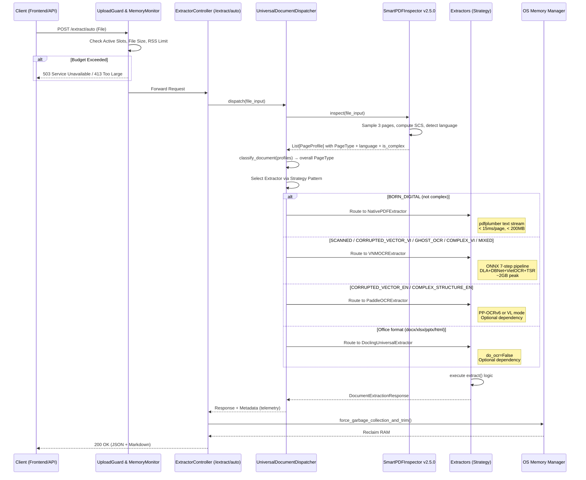

# Technical Design Document (TDD) - Release 1 & Phase 6

## 1. Architectural Overview & Design Patterns
Hệ thống VNM-OCR Backend được xây dựng trên nền tảng **FastAPI**, tuân thủ nghiêm ngặt nguyên tắc **Clean Architecture** và cấu trúc dự án `fastapi-backend-scaffold`. Hệ thống áp dụng mẫu **Strategy Pattern** qua các Extractors để hỗ trợ tính mở (Open-Closed Principle) khi bóc tách đa định dạng.

### 1.1. Component Layers
- **API Controllers (`app/api/v1/endpoints/`)**: Chuyên xử lý HTTP request/response, validation qua Pydantic schemas, không chứa business logic.
- **Service & Extractors (`app/services/` & `app/services/extractors/`)**: Chứa logic nghiệp vụ cốt lõi. Giao tiếp với hạ tầng ONNX và xử lý luồng văn bản/ảnh.
- **Middlewares (`app/middlewares/`)**: Xử lý các cross-cutting concerns (Rate Limiting, Upload Guard, Global Error Catching, Logging).
- **Engine Layer (`app/engine/`)**: Tầng giao tiếp vật lý với AI models (ONNX Runtime, Autoregressive loop). Độc lập hoàn toàn với FastAPI HTTP context.

### 1.2. Directory Structure (Phase 6 Complete)
```text
backend/app/
├── api/v1/endpoints/
│   ├── health.py           # GET /api/v1/health
│   ├── ocr.py              # POST /api/v1/ocr & /api/ocr (legacy adapter)
│   ├── layout.py           # POST /api/v1/layout
│   ├── table.py            # POST /api/v1/table
│   ├── document.py         # POST /api/v1/document/extract (RAG pipeline)
│   └── extract.py          # POST /api/v1/extract/* (Phase 6 explicit endpoints)
├── services/
│   ├── document_service.py # Pipeline PDF → Render → Layout → OCR → Markdown
│   ├── dispatcher.py       # UniversalDocumentDispatcher (Strategy Router)
│   ├── inspector.py        # SmartPDFInspector v2.5.0 (PageType classification)
│   └── extractors/
│       ├── __init__.py     # Re-export all extractors
│       ├── base.py         # BaseExtractor (ABC interface)
│       ├── native.py       # NativePDFExtractor (Fast Path, pdfplumber)
│       ├── vnm.py          # VNMOCRExtractor (ONNX 7-step pipeline)
│       ├── docling.py      # DoclingUniversalExtractor (Office, optional dep)
│       └── paddle.py       # PaddleOCRExtractor (English/Math, optional dep)
├── engine/                 # ONNX Runtime layer (6 models)
├── middlewares/            # StreamingUploadGuardMiddleware
├── schemas/                # Pydantic V2 schemas
├── exceptions/             # Custom exceptions & handlers
└── utils/                  # memory_utils, image_utils, pdf_utils
```

## 2. Sequence Diagram: Hybrid Extraction Routing (Phase 6)



## 3. Extractor Interface Contract (Strategy Pattern)

Tất cả các định dạng tài liệu được bóc tách bằng một cấu trúc Interface chung (BaseExtractor), đảm bảo API Controller không cần quan tâm đến logic phức tạp bên trong.

```python
# app/services/extractors/base.py
from abc import ABC, abstractmethod
from typing import Any, BinaryIO
from app.schemas.document import DocumentExtractionResponse

class BaseExtractor(ABC):
    """Base interface for all document extractors (Strategy Pattern)."""

    @abstractmethod
    def extract(self, file_input: BinaryIO | bytes, **kwargs: Any) -> DocumentExtractionResponse:
        """Extract document content and return standardized response."""
        pass

    def score_capability(
        self, page_type: str, language: str = "vi", is_complex: bool = False
    ) -> float:
        """Score how well this extractor handles the given document profile.
        Returns 0.0 (cannot handle) to 1.0 (perfect match).
        Default: 0.0 (subclass must override for auto-routing).
        """
        return 0.0
```

### Extractor Capabilities Matrix:

| Extractor | PageTypes xử lý | `requires_image_input` | RAM Peak | Dependency |
|-----------|-----------------|----------------------|----------|------------|
| **NativePDFExtractor** | `BORN_DIGITAL` | False | < 200MB | `pdfplumber` (core) |
| **VNMOCRExtractor** | `SCANNED`, `CORRUPTED_VECTOR_VI`, `COMPLEX_STRUCTURE_VI`, `GHOST_OCR`, `MIXED`, `IMAGE_ONLY` | True | ~2GB | `onnxruntime` (core) |
| **DoclingUniversalExtractor** | Office (docx, xlsx, pptx, html) | False | < 200MB | `docling` (optional `[extractors]`) |
| **PaddleOCRExtractor** | `COMPLEX_STRUCTURE_EN`, `CORRUPTED_VECTOR_EN`, `SCANNED` (EN) | True | ~2-4GB | `paddleocr` (optional `[extractors]`) |

### Import-on-Demand Pattern:
```python
# app/services/extractors/docling.py
import importlib.util
from fastapi import HTTPException

class DoclingUniversalExtractor(BaseExtractor):
    def extract(self, file_input, **kwargs):
        if importlib.util.find_spec("docling") is None:
            raise HTTPException(
                status_code=501,
                detail="Docling is not installed. Run: pip install .[extractors]"
            )
        from docling.document_converter import DocumentConverter
        # ... extraction logic
```

## 4. API Surface Summary

Tuân thủ nguyên tắc API Design Patterns, API Surface cung cấp cả Legacy endpoints và Explicit Dedicated Endpoints.

### 4.1. Legacy Endpoints (Phase 1-5, vẫn hoạt động)
- `GET /api/v1/health` — Liveness, models ready, memory stats
- `POST /api/v1/ocr` — OCR ảnh đơn
- `POST /api/v1/layout` — DLA only
- `POST /api/v1/table` — TSR only
- `POST /api/v1/document/extract` — Full RAG pipeline
- `POST /api/ocr` — Legacy UI adapter

### 4.2. Phase 6 Explicit Endpoints (`extract.py`)
- `POST /api/v1/extract/auto` — Router tự động qua SmartPDFInspector
- `POST /api/v1/extract/native/pdf` — Explicit Digital PDF
- `POST /api/v1/extract/vnm` — Explicit pipeline tiếng Việt
- `POST /api/v1/extract/docling` — Explicit Office processing
- `POST /api/v1/extract/paddle/ocr` — Explicit tiếng Anh
- `POST /api/v1/extract/paddle/complex-vlm` — Explicit Paper/Math VLM

### 4.3. Telemetry Metadata Output (Consistent Response)
```json
{
  "total_pages": 5,
  "full_markdown": "...",
  "pages": [...],
  "elapsed_ms": 1520.5,
  "metadata": {
    "is_pdf": true,
    "classification": "SCANNED",
    "pipeline_used": "VNMOCRExtractor",
    "requires_image_input": true,
    "is_vector_recovery": false,
    "sampled_profiles": [...]
  }
}
```

## 5. Memory Management & Multi-threading

Để đảm bảo không bao giờ vi phạm giới hạn RAM 2GB (Soft) và 3.5GB (Hard), hệ thống áp dụng:
1. **Semaphore Khóa Luồng (ocr_semaphore)**: Giới hạn tối đa 1 hoặc 2 request chạy model cùng lúc. Queue timeout = 30s (hỗ trợ VLM).
2. **Explicit Garbage Collection**: Hàm `force_garbage_collection_and_trim()` (gọi OS malloc_trim hoặc HeapCompact) luôn nằm trong khối `finally` của API Controller.
3. **Lazy Loading (On-demand)**: EngineManager đảm bảo mô hình ONNX chỉ nạp khi VNMOCRExtractor được invoke. Docling và PaddleOCR tuân thủ nguyên tắc tương tự (Import on demand) để tránh phình to baseline RAM.
4. **Memory Budget Monitor**: Kiểm tra RSS trước accept request và sau mỗi page processing. Soft limit 2GB → GC tích cực. Hard limit 3.5GB → HTTP 503.

## 6. UniversalDocumentDispatcher — Cập nhật Phase 6

### 6.1. Hiện trạng Code (`dispatcher.py`)
Dispatcher hiện tại chỉ gọi `document_service.extract_document()` cho mọi loại tài liệu. Cần cập nhật để:
1. Route đến đúng Extractor instance dựa trên PageType.
2. Truyền cờ `requires_image_input` và `is_vector_recovery` vào response metadata.
3. Hỗ trợ cả Office formats (không chỉ PDF).

### 6.2. Thiết kế mới
```python
class UniversalDocumentDispatcher:
    def __init__(self):
        self.inspector = SmartPDFInspector
        self._extractors: dict[str, BaseExtractor] = {}

    def register_extractor(self, name: str, extractor: BaseExtractor):
        self._extractors[name] = extractor

    def _select_extractor(self, page_type: PageType, language: str, is_complex: bool) -> BaseExtractor:
        """Select best extractor based on PageType + language via score_capability()."""
        best_score, best_ext = 0.0, None
        for ext in self._extractors.values():
            score = ext.score_capability(page_type.value, language, is_complex)
            if score > best_score:
                best_score, best_ext = score, ext
        if best_ext is None:
            raise ValueError(f"No extractor can handle: {page_type}")
        return best_ext
```
