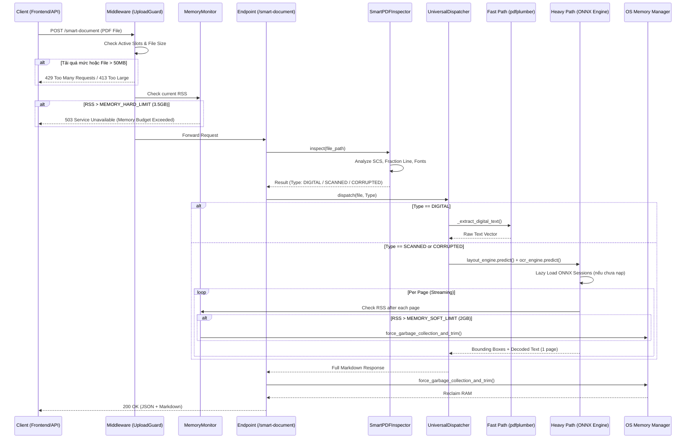

# Technical Design Document (TDD) - Release 1

## 1. Sơ đồ Tuần tự (Sequence Diagram) - Luồng Smart PDF Classification & Extraction



## 2. Thiết kế Lớp (Class Design)

### 2.1. Backend Core Interfaces

- **BaseExtractor:**
  - `def extract(file: BinaryIO) -> ExtractorResult`
  - `def capability_score(doc_profile) -> float`

- **BaseRecognizer (Interface cho extensibility VLM):**
  - `def recognize(image: np.ndarray) -> list[tuple[str, float]]`
  - `def get_memory_requirement() -> int`  (bytes cần thiết để nạp model)
  - Implementations: `ONNXRecognizer` (Release 1), `VLMRecognizer` (Future)

- **SmartPDFInspector:**
  - `def evaluate_scs(pdf_path: str) -> float`
  - `def detect_math_gates(pdf_path: str) -> bool`

- **UniversalDocumentDispatcher:**
  - `def route_document(file: BinaryIO) -> BaseExtractor`

- **EngineManager (Singleton):**
  - `def get_engine(model_type: str) -> ONNXSession`
  - `def clear_sessions()`
  - Tích hợp thread-safety lock `asyncio.Lock()` khi nạp mô hình trong môi trường web.

- **MemoryBudgetMonitor:**
  - `def get_rss_mb() -> float`
  - `def check_can_accept_request() -> bool`
  - `def check_can_load_model(model_memory_bytes: int) -> bool`
  - `def get_budget_status() -> dict` (trả về `{"rss_mb", "soft_limit_mb", "hard_limit_mb", "status"}`)

## 3. Kiến trúc Đa luồng & Semaphore
Để đảm bảo giới hạn phần cứng (2 luồng, <= 2GB RAM cho Tier 1, <= 4GB cho Tier 2), tất cả các hàm liên quan đến ONNX/VLM Inference đều phải bị bọc bởi một Semaphore toàn cục:
```python
# app/core/state.py
import asyncio
ocr_semaphore = asyncio.Semaphore(1)

# app/api/v1/endpoints/document.py
async def extract_doc():
    # Kiểm tra memory budget TRƯỚC KHI chờ semaphore
    monitor = get_memory_monitor()
    if not monitor.check_can_accept_request():
        raise HTTPException(
            status_code=503, 
            detail="Server memory budget exceeded. Please retry later.",
            headers={"Retry-After": "30"},
        )
    
    try:
        async with asyncio.timeout(30): # Đợi slot 30s (tăng từ 10s để hỗ trợ VLM chậm)
            async with ocr_semaphore:
                result = await asyncio.to_thread(service.extract, file.file)
                
                # Kiểm tra RSS sau inference
                if monitor.get_rss_mb() > settings.MEMORY_SOFT_LIMIT_MB:
                    force_garbage_collection_and_trim()
                    
                return result
    except TimeoutError:
        raise HTTPException(status_code=503, detail="Server overloaded")
```

> **Lưu ý timeout:** Queue timeout được tăng từ 10s lên 30s để đảm bảo VLM (tương lai) có đủ thời gian xử lý. OCR timeout vẫn giữ 120s cho xử lý PDF nhiều trang.

## 4. Quản lý Thư mục Tạm (Temp Sandbox)
```python
# app/main.py
import tempfile
from pathlib import Path

TEMP_DIR = Path(__file__).resolve().parent.parent / "temp"
TEMP_DIR.mkdir(exist_ok=True)
tempfile.tempdir = str(TEMP_DIR)
```
- Phải đảm bảo `temp/` nằm trong `.gitignore` để tránh rác sinh ra trong quá trình deploy.

## 5. Memory Budget Configuration
```python
# app/core/config.py (bổ sung)
class Settings(BaseSettings):
    # Memory Budget (configurable via .env)
    MEMORY_SOFT_LIMIT_MB: float = 2048.0     # 2GB - Trigger aggressive GC
    MEMORY_HARD_LIMIT_MB: float = 3584.0     # 3.5GB - Reject new requests
    MEMORY_CRITICAL_RATIO: float = 0.90      # 90% total system RAM - Emergency unload
    
    # VLM Configuration (Future-ready)
    OCR_RECOGNIZER_BACKEND: str = "onnx"     # "onnx" or "vlm"
    VLM_MIN_AVAILABLE_RAM_MB: float = 3072.0 # 3GB minimum free RAM to load VLM
```

> **Đối với laptop 16GB RAM:**
> - Soft limit 2GB → GC chủ động, giữ ứng dụng nhẹ nhàng.
> - Hard limit 3.5GB → Từ chối request, bảo vệ hệ thống.
> - Critical 90% (14.4GB) → Không bao giờ đạt vì hard limit đã chặn trước.
> - Kết quả: Ứng dụng luôn dưới 4GB, OS và ứng dụng khác có ≥12GB.
