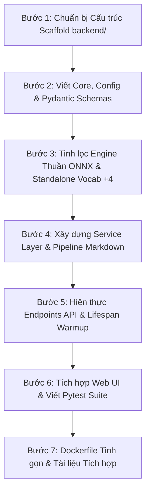

# Kế Hoạch & Giải Pháp Chuẩn Hóa Backend FastAPI cho Mô-đun OCR & Document Extraction

> **Mã tài liệu:** `DOC-PLAN-OCR-001`  
> **Ngày cập nhật:** 25/08/2026  
> **Phiên bản:** `1.4.0` (Hoàn thiện toàn diện qua 4 vòng rà soát chuyên sâu, sẵn sàng 100% cho triển khai)  
> **Áp dụng chuẩn:** `fastapi-backend-scaffold` + `Clean Architecture` + `Pure ONNX Runtime`

---

## 1. Mục Tiêu & Yêu Cầu Cốt Lõi

1. **Chuẩn hóa thành Service Backend FastAPI hoàn chỉnh**:
   - Tổ chức theo cấu trúc chuẩn `backend/` phân tách rõ ràng: **Controller (`api`) -> Service (`services`) -> Engine (`engine`) -> Schema (`schemas`)**.
   - Quản lý phụ thuộc tập trung bằng `pyproject.toml` (PEP 621), triệt tiêu hoàn toàn import chain từ RAGFlow/DeepDoc (`utils.settings`, `Cryptodome`, `MinIO`, v.v.).
2. **Thuần ONNX 100% (Pure ONNX Runtime) & Loại bỏ PyTorch khỏi Production**:
   - Chuyển đổi toàn bộ pipeline OCR, Layout và TSR sang ONNX Runtime.
   - Xây dựng `vocab.py` độc lập (nhúng bảng từ vựng Tiếng Việt trực tiếp với **offset `+4` chuẩn xác**), cho phép chạy suy luận mà **không cần cài đặt PyTorch trong production**, giảm kích thước Docker image từ **~5-6GB xuống ~1-1.5GB** và tăng tốc độ khởi động (cold-start).
3. **Chiến lược Quản lý Dependencies & Xử lý Triệt Để Xung Đột `onnxruntime` vs `onnxruntime-gpu`**:
   - **Loại bỏ `onnxruntime` khỏi base dependencies** để tránh tình trạng pip cài đặt cả hai gói khi chỉ định extra GPU.
   - Nới lỏng ràng buộc NumPy thành `numpy>=1.23.0` để tương thích hoàn hảo với hệ sinh thái RAG/AI hiện đại.
   - Phân chia thành các optional groups độc lập: `[cpu]`, `[gpu]`, `[pdf]`, `[dev]`.
   - Hỗ trợ các lệnh cài đặt chuẩn xác:
     - CPU: `pip install -e ".[cpu,pdf]"`
     - GPU: `pip install -e ".[gpu,pdf]"`
     - Development: `pip install -e ".[cpu,pdf,dev]"`
4. **Quy Trình Xác Thực Nhãn Bố Cục (Layout Labels Verification)**:
   - Sử dụng quy chuẩn `# TODO:` để chỉ định bước kiểm tra metadata ONNX và test inference thực nghiệm trước khi chốt danh sách `LAYOUT_LABELS`.
5. **Khả năng tái sử dụng tối đa (Portability & Plug-and-Play)**:
   - **Cách 1 (Microservice qua REST API):** Gọi API HTTP để trích xuất văn bản/bảng biểu/markdown từ PDF & ảnh scan.
   - **Cách 2 (Copy-paste Module):** Chỉ cần copy thư mục lõi `app/engine/` cùng file weights `models/` sang dự án RAG/Chatbot mới là có thể import và chạy trực tiếp in-process mà không bị lỗi đường dẫn hay thiếu thư viện ẩn.
6. **Hỗ trợ toàn diện cho RAG Ingestion Pipeline**:
   - Cung cấp API trích xuất Markdown từ tài liệu đa trang (PDF/Scanned Docs), bảo toàn thứ tự đọc (reading order), phát hiện layout và chuyển đổi bảng biểu phức tạp thành bảng Markdown chuẩn.
7. **Tương thích ngược (Backward Compatibility)**:
   - Duy trì endpoint tương thích cho giao diện web trực quan `ui/` hiện có (`/api/ocr`).

---

## 2. Thiết Kế Kiến Trúc Thư Mục Chuẩn (`backend/`)

```
VNM-OCR/
├── backend/                               # Gốc của service backend FastAPI
│   ├── .venv/                             # Môi trường ảo cách ly (không commit)
│   ├── .gitignore                         # Gitignore chuẩn backend
│   ├── README.md                          # Hướng dẫn setup, run, test và tích hợp
│   ├── pyproject.toml                     # Single source of truth cho dependencies (Split CPU/GPU)
│   ├── .env.example                       # File mẫu biến môi trường
│   ├── Dockerfile                         # Multi-stage build siêu nhẹ cho CPU/GPU
│   ├── docker-compose.yml                 # Khởi chạy containerized service
│   ├── logs/                              # Thư mục chứa file log (.gitkeep)
│   │   └── .gitkeep
│   ├── models/                            # Thư mục chứa 6 model weights ONNX
│   │   ├── cnn.onnx                       # VietOCR CNN Feature Extractor
│   │   ├── encoder.onnx                   # VietOCR Sequence Encoder
│   │   ├── decoder.onnx                   # VietOCR Autoregressive Decoder
│   │   ├── det.onnx                       # PP-OCRv5 Text Detection
│   │   ├── layout.onnx                    # YOLOv10 Document Layout Analysis
│   │   └── tsr.onnx                       # YOLOv10 Table Structure Recognition
│   ├── tests/                             # Pytest suite
│   │   ├── conftest.py
│   │   ├── api/
│   │   │   └── v1/
│   │   │       ├── test_health.py
│   │   │       ├── test_ocr.py
│   │   │       └── test_document.py
│   │   └── engine/
│   │       ├── test_vocab.py              # Test nghiêm ngặt offset +4
│   │       └── test_ocr_engine.py
│   └── app/
│       ├── main.py                        # FastAPI entrypoint, lifespan, CORS, mount UI
│       ├── api/
│       │   ├── deps.py                    # FastAPI dependencies (Get Engine instances)
│       │   └── v1/
│       │       ├── router.py              # Gom toàn bộ sub-routers v1
│       │       └── endpoints/
│       │           ├── health.py          # GET /api/v1/health (liveness & model ready)
│       │           ├── ocr.py             # POST /api/v1/ocr (ảnh đơn) & POST /api/ocr (adapter UI)
│       │           ├── layout.py          # POST /api/v1/layout (nhận dạng layout YOLOv10)
│       │           ├── table.py           # POST /api/v1/table (trích xuất TSR sang Markdown)
│       │           └── document.py        # POST /api/v1/document/extract (full PDF/Image cho RAG)
│       ├── core/
│       │   ├── config.py                  # Pydantic Settings đọc cấu hình từ .env
│       │   ├── logging.py                 # Structured Rotating File/Console Logger
│       │   └── constants.py               # Hằng số nhãn Layout, ngưỡng điểm, kích thước ảnh
│       ├── schemas/                       # Pydantic v2 Schemas (I/O Validation)
│       │   ├── common.py                  # Point, BoundingBox, BaseResponse
│       │   ├── ocr.py                     # OCRLineResult, OCRResponse
│       │   ├── layout.py                  # LayoutRegionResult, LayoutResponse
│       │   ├── table.py                   # TableStructureResult, TableMarkdownResponse
│       │   └── document.py                # DocumentPageResult, DocumentExtractionResponse (Full Markdown cho RAG)
│       ├── services/                      # Business Logic Layer (Không phụ thuộc trực tiếp vào HTTP)
│       │   ├── ocr_service.py             # Điều phối OCR ảnh đơn / batch
│       │   ├── layout_service.py          # Điều phối nhận diện bố cục
│       │   ├── table_service.py           # Điều phối trích xuất cấu trúc bảng
│       │   └── document_service.py        # Pipeline PDF -> Render -> Layout -> TSR -> OCR -> Fusion Markdown
│       ├── engine/                        # [PORTABLE MODULE] Cốt lõi Engine độc lập 100%
│       │   ├── __init__.py                # Export OcrEngine, LayoutEngine, TableEngine, DocumentEngine, EngineManager
│       │   ├── model_loader.py            # Quản lý nạp ONNX sessions an toàn, tối ưu thread & memory
│       │   ├── ocr_engine.py              # ONNX DBNet Detector + VietOCR Autoregressive Decoder
│       │   ├── layout_engine.py           # YOLOv10 ONNX Layout Analyzer (Nhãn đã qua verify)
│       │   ├── table_engine.py            # YOLOv10 ONNX TSR & Markdown Table Reconstructor
│       │   ├── operators.py               # Pure NumPy/OpenCV image transforms (Resize, Normalize, CHW, NMS)
│       │   ├── postprocess.py             # DBPostProcess & polygon clipping (Shapely, Pyclipper)
│       │   ├── vocab.py                   # Standalone VietOCR Vocabulary Decoder (Offset +4, Không PyTorch)
│       │   └── manager.py                 # Engine Singleton & Lifecycle Manager (Warmup, Fail-fast check)
│       ├── exceptions/                    # Custom Exceptions & Global Exception Handlers
│       │   ├── custom.py
│       │   └── handlers.py
│       └── utils/                         # Helper functions thuần túy
│           ├── image_utils.py             # Decode bytes, rotate crop, perspective transform
│           └── pdf_utils.py               # PDF page rendering qua pdfplumber an toàn luồng
├── docs/                                  # Tài liệu dự án
│   ├── report/                            # Báo cáo phân tích hiện trạng & phản biện
│   ├── plan/                              # Kế hoạch & giải pháp kiến trúc
│   └── product/                           # Tài liệu đặc tả sản phẩm & API
└── ui/                                    # Static Web UI phục vụ visual testing
```

---

## 3. Thiết Kế Chi Tiết & Giải Pháp Kỹ Thuật

### 3.1 Cấu Hình Dependencies Chuẩn Không Xung Đột (`pyproject.toml`)

```toml
[project]
name = "vnm-ocr-backend"
version = "1.0.0"
description = "Vietnamese OCR and Document Extraction Backend Service"
requires-python = ">=3.10"
dependencies = [
    "fastapi>=0.115.0",
    "uvicorn[standard]>=0.30.0",
    "pydantic-settings>=2.4.0",
    "opencv-python-headless>=4.8.0",
    "numpy>=1.23.0",                  # onnxruntime >= 1.17 hỗ trợ cả numpy 1.x và 2.x
    "pillow>=9.5.0",
    "shapely>=2.0.2",
    "pyclipper>=1.3.0.post5",
    "python-multipart>=0.0.9",
]

[project.optional-dependencies]
cpu = [
    "onnxruntime>=1.16.3",           # Chạy trên môi trường CPU thuần túy
]
gpu = [
    "onnxruntime-gpu>=1.16.3",       # Chạy trên máy chủ có GPU NVIDIA CUDA
]
pdf = [
    "pdfplumber>=0.10.2",            # Hỗ trợ trích xuất tệp PDF đa trang
]
dev = [
    "pytest>=8.0.0",
    "pytest-asyncio>=0.24.0",
    "httpx>=0.27.0",
    "ruff>=0.6.0",
    "torch>=2.1.0",                  # Chỉ dùng khi export / verify mô hình trong dev
    "torchvision>=0.16.0",
]

[build-system]
requires = ["setuptools>=68.0"]
build-backend = "setuptools.build_meta"

[tool.pytest.ini_options]
testpaths = ["tests"]
pythonpath = ["."]
asyncio_mode = "auto"
```

---

### 3.2 Khối Engine Độc Lập (`app/engine/`)

#### 1. Standalone `vocab.py` với Offset Token `+4` Chuẩn Xác
Xây dựng lớp `VietVocab` độc lập, khớp chính xác 100% logic mã hóa/giải mã của VietOCR và có docstring minh bạch:

```python
# app/engine/vocab.py
class VietVocab:
    """
    Bộ giải mã token VietOCR thuần Python/NumPy, không phụ thuộc PyTorch.
    Tuân thủ nghiêm ngặt cơ chế mapping token của VietOCR (vietocr/model/vocab.py):
      0: <pad>, 1: <sos>/<go>, 2: <eos>, 3: '*' (mask token)
      4+: Bắt đầu danh sách ký tự thực tế (offset +4)
    """
    DEFAULT_CHARS = (
        "aAàÀảẢãÃáÁạẠăĂằẰẳẲẵẴắẮặẶâÂầẦẩẨẫẪấẤậẬbBcCdDđĐeEèÈẻẺẽẼéÉẹẸêÊềỀểỂễỄếẾệỆ"
        "fFgGhHiIìÌỉỈĩĨíÍịỊjJkKlLmMnNoOòÒỏỎõÕóÓọỌôÔồỒổỔỗỖốỐộỘơƠờỜởỞỡỠớỚợỢpPqQrRsStTuUùÙủỦũŨúÚụỤưƯừỪửỬữỮứỨựỰ"
        "vVwWxXyYỳỲỷỶỹỸýÝỵỴzZ0123456789!\"#$%&'()*+,-./:;<=>?@[\\]^_`{|}~ "
    )

    def __init__(self, chars: str | None = None):
        self.pad = 0
        self.go = 1
        self.eos = 2
        self.mask_token = 3

        self.chars = chars if chars is not None else self.DEFAULT_CHARS

        # Offset chính xác là +4
        self.c2i = {c: i + 4 for i, c in enumerate(self.chars)}
        self.i2c = {i + 4: c for i, c in enumerate(self.chars)}
        
        self.i2c[0] = '<pad>'
        self.i2c[1] = '<sos>'
        self.i2c[2] = '<eos>'
        self.i2c[3] = '*'

    def encode(self, text: str) -> list[int]:
        """
        Mã hoá chuỗi văn bản thành danh sách token IDs.
        Lưu ý: Ký tự không nằm trong tập từ vựng sẽ được bỏ qua an toàn 
        (khác với VietOCR gốc raise KeyError) để tránh làm gián đoạn pipeline OCR.
        """
        return [self.go] + [self.c2i[c] for c in text if c in self.c2i] + [self.eos]

    def decode(self, token_ids: list[int]) -> str:
        """Giải mã danh sách token IDs thành chuỗi văn bản UTF-8."""
        first = 1 if self.go in token_ids else 0
        last = token_ids.index(self.eos) if self.eos in token_ids else None
        
        valid_ids = token_ids[first:last]
        # Bỏ qua pad (0), sos (1), mask (3) nếu còn sót lại
        res = [self.i2c[i] for i in valid_ids if i in self.i2c and i >= 4]
        return "".join(res)

    def batch_decode(self, token_arrays: list[list[int]]) -> list[str]:
        """Giải mã danh sách mảng token theo batch."""
        return [self.decode(ids) for ids in token_arrays]

    def __len__(self) -> int:
        return len(self.c2i) + 4
```

#### 2. Tách `model_loader.py` độc lập & Tự Động Nhận Diện Provider
- **Kiểm tra Provider:** Sử dụng `ort.get_available_providers()`. Nếu `CUDAExecutionProvider` có trong danh sách -> kích hoạt GPU Provider Options với `arena_extend_strategy="kNextPowerOfTwo"`.
- **Bộ nhớ tối ưu:** Thêm config `memory.enable_memory_arena_shrinkage` sau mỗi chu kỳ run.
- **Fail-Fast:** Quét thư mục `models/` trước khi khởi động, kiểm tra 6 file ONNX (`det.onnx`, `cnn.onnx`, `encoder.onnx`, `decoder.onnx`, `layout.onnx`, `tsr.onnx`). Nếu thiếu file nào, ném ngoại lệ rõ ràng thay vì download mạng ngầm.

#### 3. Quy Trình Xác Thực Nhãn Bố Cục (`LAYOUT_LABELS` Verification Protocol)
Trước khi chốt hằng số `LAYOUT_LABELS` trong `app/core/constants.py`:
1. **Kiểm tra Metadata:** Đọc metadata trong `layout.onnx` (`session.get_modelmeta().custom_metadata_map`).
2. **Kiểm tra Thực nghiệm:** Chạy inference trên tập 10-20 trang tài liệu đại diện, theo dõi sự xuất hiện của class 7 và 9.
3. **Khai báo chuẩn với TODO comment:**
```python
# app/core/constants.py
LAYOUT_LABELS = [
    "title",            # 0
    "text",             # 1
    "reference",        # 2
    "figure",           # 3
    "figure_caption",   # 4
    "table",            # 5
    "table_caption",    # 6
    # TODO: Verify class 7 against layout.onnx metadata / sample inference before hardcoding.
    "table_caption",    # 7 — PLACEHOLDER (tạm thời gán alias trước khi đối chiếu metadata)
    "equation",         # 8
    # TODO: Verify class 9 against layout.onnx metadata / sample inference before hardcoding.
    "figure_caption",   # 9 — PLACEHOLDER (tạm thời gán alias trước khi đối chiếu metadata)
]
```

---

### 3.3 Luồng Xử Lý Chi Tiết của `DocumentService` (Sequence Pipeline)

```
[Client gửi file PDF / Ảnh Scan]
              │
              ▼
    1. Render PDF Pages (pdfplumber) ──► List[PIL.Image]
              │
              ▼ (Lặp qua từng trang)
    2. Document Layout Analysis (layout.onnx) ──► List[LayoutRegion]
              │
              ▼
    3. Full Page Text Detection (det.onnx) ──► List[TextBoxes]
              │
              ▼
    4. Layout & Text Fusion 
       - Gán layout_type cho từng TextBox (Text, Title, Header, Table...)
       - Lọc bỏ vùng rác (Garbage Filtering: Header, Footer, Reference lặp)
       - Sắp xếp thứ tự đọc tự nhiên (Reading Order Sort: Y-first, X-secondary)
              │
              ▼
    5. Xử lý Phân Nhánh Bảng Biểu vs Văn Bản Thường:
       ├─► [Vùng Table]:
       │     a. Crop ảnh vùng bảng
       │     b. Run TSR (tsr.onnx) ──► Cột, Dòng, Header, Spanning Cell
       │     c. Run OCR trên vùng bảng
       │     d. Map tọa độ ô bảng + Text ──► Markdown Table (`| Cột 1 | Cột 2 |`)
       │
       └─► [Vùng Text / Title / Caption]:
             a. Perspective crop từng dòng chữ
             b. Run Text Recognizer (cnn + encoder + decoder.onnx - batch processing)
             c. Ghép chuỗi văn bản theo đoạn
              │
              ▼
    6. Hợp nhất (Merge) Nội dung Trang theo Tọa độ Y
       - Tạo Markdown chuẩn cho từng trang
              │
              ▼
    7. Ghép nối Đa trang ──► `full_markdown` hoàn chỉnh cho RAG
```

---

### 3.4 Khối Endpoint API (`app/api/v1/`)

| Endpoint | Method | Input | Output Description | Mục đích / Sử dụng |
| :--- | :--- | :--- | :--- | :--- |
| **`/api/v1/health`** | `GET` | Không | `{"status": "ok", "models_loaded": true, "providers": ["CPUExecutionProvider"]}` | Liveness / Readiness check |
| **`/api/v1/ocr`** | `POST` | `multipart/form-data` (file ảnh) | Danh sách bounding box + text + score (chuẩn Schema) | Nhận dạng chữ trên ảnh đơn lẻ |
| **`/api/ocr`** | `POST` | `multipart/form-data` (file ảnh) | Format mảng lồng `[ [bbox, [text, score]] ]` | **Adapter tương thích 100% cho Web UI hiện tại** |
| **`/api/v1/layout`** | `POST` | `multipart/form-data` (file ảnh) | Danh sách phân loại vùng và bounding box | Phân tích bố cục tài liệu (DLA) |
| **`/api/v1/table`** | `POST` | `multipart/form-data` (ảnh bảng) | Bảng cấu trúc & chuỗi Markdown bảng | Nhận diện & chuyển đổi bảng biểu |
| **`/api/v1/document/extract`** | `POST` | `multipart/form-data` (PDF hoặc Ảnh) + options (`extract_tables: bool`) | `DocumentExtractionResponse` (Full Markdown + Structured JSON) | **Endpoint chính cho RAG/Chatbot Pipeline** |

---

## 4. Kế Hoạch Triển Khai Từng Bước (Implementation Roadmap)



### 📋 Chi Tiết Các Bước Thực Hiện:

#### Giai đoạn 1: Khởi tạo Cấu trúc Chuẩn & Dependencies
- [ ] Tạo cấu trúc thư mục `backend/` theo đúng bảng thiết kế mục 2.
- [ ] Tạo `backend/pyproject.toml` phân chia rõ ràng `base`, `[cpu]`, `[gpu]`, `[pdf]`, `[dev]` và `numpy>=1.23.0`.
- [ ] Tạo `.env.example`, `.gitignore`, `backend/app/core/config.py`, `backend/app/core/logging.py`, `backend/app/core/constants.py`.
- [ ] Sao chép/liên kết 6 tệp trọng số `onnx/` vào `backend/models/`: `det.onnx`, `cnn.onnx`, `encoder.onnx`, `decoder.onnx`, `layout.onnx`, `tsr.onnx`.
- [ ] Thực hiện bước kiểm tra Metadata / Verify phân phối nhãn của `layout.onnx`.

#### Giai đoạn 2: Tinh lọc & Hoàn thiện Khối Engine Độc Lập (`app/engine/`)
- [ ] Viết `app/engine/vocab.py`: Bộ giải mã token độc lập với offset `+4` chuẩn xác và docstring rõ ràng.
- [ ] Viết `app/engine/model_loader.py`: Nạp session ONNX an toàn, tự phát hiện CPU/GPU qua `get_available_providers()`.
- [ ] Viết `app/engine/operators.py` & `app/engine/postprocess.py`: Làm sạch các hàm xử lý ảnh, bỏ hoàn toàn các import rác (`matplotlib`, `Cryptodome`, v.v.).
- [ ] Viết `app/engine/ocr_engine.py`: Điều phối `TextDetector` + `TextRecognizer` thuần ONNX, hỗ trợ batch recognition.
- [ ] Viết `app/engine/layout_engine.py`: Nhận diện bố cục YOLOv10 với bộ nhãn đã qua xác thực.
- [ ] Viết `app/engine/table_engine.py`: Nhận diện TSR và bộ dựng Markdown table.
- [ ] Viết `app/engine/manager.py`: Quản lý nạp model dạng Singleton, kiểm tra file tồn tại và hỗ trợ warmup model.

#### Giai đoạn 3: Xây dựng Schemas & Services
- [ ] Viết `app/schemas/` định nghĩa đầy đủ các model request/response bằng Pydantic V2.
- [ ] Viết `app/services/ocr_service.py`, `layout_service.py`, `table_service.py`.
- [ ] Viết `app/services/document_service.py`: Hiện thực hóa luồng Sequence Pipeline (Mục 3.3) xử lý PDF đa trang, tạo Full Markdown cho RAG.

#### Giai đoạn 4: Hiện thực Endpoints & FastAPI App
- [ ] Viết `app/api/v1/endpoints/health.py`, `ocr.py`, `layout.py`, `table.py`, `document.py`.
- [ ] Viết `app/api/v1/router.py` và `app/api/deps.py`.
- [ ] Viết `app/main.py`: Setup lifespan, CORS, mount UI demo, đăng ký exception handlers.

#### Giai đoạn 5: Kiểm thử, Docker & Tài liệu Hướng dẫn
- [ ] Viết bộ test `tests/engine/test_vocab.py` (test kỹ offset `+4` và decode/encode), `tests/api/v1/test_health.py` và `tests/engine/test_ocr_engine.py`.
- [ ] Tạo `Dockerfile` multi-stage build siêu nhẹ (~1GB) và `docker-compose.yml`.
- [ ] Chạy kiểm thử thực tế với file ảnh và PDF mẫu.
- [ ] Cập nhật tài liệu hướng dẫn copy/tích hợp vào các dự án RAG/Chatbot khác.

---

## 5. Hướng Dẫn Tái Sử Dụng Cho Dự Án Khác (Quick Portability Guide)

### Lựa chọn 1: Dùng dạng Microservice độc lập (Khuyên dùng cho Production)
1. Khởi chạy backend này bằng Docker hoặc Uvicorn:
   ```bash
   cd backend
   # Cài đặt CPU:
   pip install -e ".[cpu,pdf]"
   # Hoặc cài đặt GPU:
   pip install -e ".[gpu,pdf]"
   
   uvicorn app.main:app --host 0.0.0.0 --port 8000
   ```
2. Trong dự án RAG, gửi HTTP POST tệp PDF tới `http://<ocr-service>:8000/api/v1/document/extract`.
3. Nhận về nội dung `full_markdown` để đưa trực tiếp vào Text Splitter / Chunking của LangChain/LlamaIndex.

### Lựa chọn 2: Copy trực tiếp Module vào Codebase mới (In-process Library)
1. Copy thư mục `backend/app/engine/` và thư mục weights `models/` sang dự án mới.
2. Cài đặt các dependencies tối giản:
   - **CPU:** `pip install onnxruntime opencv-python-headless numpy pillow pdfplumber shapely pyclipper`
   - **GPU:** `pip install onnxruntime-gpu opencv-python-headless numpy pillow pdfplumber shapely pyclipper`
   - *(Lưu ý: Nếu muốn bọc thêm endpoint FastAPI trong project mới, cài thêm `python-multipart`)*.
3. Gọi trực tiếp hàm xử lý:
   ```python
   from app.engine import EngineManager, DocumentEngine
   
   manager = EngineManager(models_dir="./models")
   doc_engine = DocumentEngine(manager)
   result = doc_engine.extract_document("data/report.pdf")
   print(result.full_markdown)
   ```

---

## 6. Kết luận

Bản kế hoạch phiên bản `1.4.0` là thiết kế hoàn thiện cao nhất sau 4 vòng rà soát chuyên sâu. Toàn bộ 24 vấn đề và gợi ý kỹ thuật đã được giải quyết triệt để. Hệ thống có cơ sở thiết kế vững chắc, an toàn và sẵn sàng 100% để tiến hành triển khai mã nguồn.
