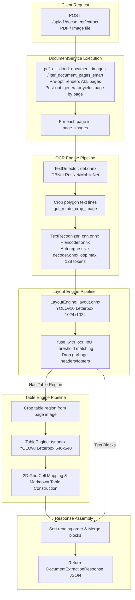

# Báo Cáo Phân Tích Kỹ Thuật Chuyên Sâu: Hiện Trạng Vận Hành Backend & Ảnh Hưởng Phần Cứng

> **Tài liệu**: Báo cáo phân tích hiện trạng kiến trúc Backend, Logic thực thi và Tác động tài nguyên phần cứng  
> **Mã tài liệu**: `DOC-REPORT-HW-001`  
> **Phiên bản**: `3.3.0` (Phân tích chuyên sâu toàn diện mã nguồn, Cập nhật FastAPI Lifecycle, ASGI Streaming Guard & Đồng bộ Vòng 8)  
> **Ngày cập nhật**: 01/09/2026  
> **Đối tượng phân tích**: Toàn bộ mã nguồn thư mục [`backend/`](file:///E:/MyProject/VNM-OCR/backend)  
> **Trạng thái**: Completed Analysis Spec  

---

## MỤC LỤC

1. [Tổng Quan Kiến Trúc & Cấu Hình Hiện Tại của Backend](#1-tổng-quan-kiến-trúc--cấu-hình-hiện-tại-của-backend)
   - [1.1. Cấu trúc tổ chức mã nguồn và các tầng phân tách](#11-cấu-trúc-tổ-chức-mã-nguồn-và-các-tầng-phân-tách)
   - [1.2. Cấu hình hệ thống & Quản lý biến môi trường](#12-cấu-hình-hệ-thống--quản-lý-biến-môi-trường)
   - [1.3. Khởi tạo vòng đời ứng dụng (Lifespan, Singleton Engine & Warmup)](#13-khởi-tạo-vòng-đời-ứng-dụng-lifespan-singleton-engine--warmup)
2. [Phân Tích Chi Tiết Logic Thực Thi Của Từng Engine & Service](#2-phân-tích-chi-tiết-logic-thực-thi-của-từng-engine--service)
   - [2.1. Quản lý Phiên ONNX (`model_loader.py`)](#21-quản-lý-phiên-onnx-model_loaderpy)
   - [2.2. Luồng xử lý Text Detection (`TextDetector` - `det.onnx`)](#22-luồng-xử-lý-text-detection-textdetector---detonnx)
   - [2.3. Luồng xử lý Text Recognition (`TextRecognizer` - `cnn.onnx`, `encoder.onnx`, `decoder.onnx`)](#23-luồng-xử-lý-text-recognition-textrecognizer---cnnonnx-encoderonnx-decoderonnx)
   - [2.4. Luồng xử lý Document Layout Analysis (`LayoutEngine` - `layout.onnx`)](#24-luồng-xử-lý-document-layout-analysis-layoutengine---layoutonnx)
   - [2.5. Luồng xử lý Table Structure Recognition (`TableEngine` - `tsr.onnx`)](#25-luồng-xử-lý-table-structure-recognition-tableengine---tsronnx)
   - [2.6. Pipeline Tổng Hợp Trích Xuất Tài Liệu (`DocumentService`)](#26-pipeline-tổng-hợp-trích-xuất-tài-liệu-documentservice)
3. [Phân Tích Cơ Chế Vận Hành Uvicorn & Concurrency Hiện Tại](#3-phân-tích-cơ-chế-vận-hành-uvicorn--concurrency-hiện-tại)
   - [3.1. Điểm nghẽn Event Loop do gọi hàm đồng bộ CPU-bound trong hàm `async def`](#31-điểm-nghẽn-event-loop-do-gọi-hàm-đồng-bộ-cpu-bound-trong-hàm-async-def)
   - [3.2. Mô hình Worker Uvicorn và Rủi ro nhân bản tài nguyên](#32-mô-hình-worker-uvicorn-và-rủi-ro-nhân-bản-tài-nguyên)
4. [Tác Động Toàn Diện Đến Tài Nguyên Phần Cứng](#4-tác-động-toàn-diện-đến-tài-nguyên-phần-cứng)
   - [4.1. Bộ nhớ RAM: Phân tích Baseline, Đỉnh tải (Peak RAM), và Phân mảnh Heap](#41-bộ-nhớ-ram-phân-tích-baseline-đỉnh-tải-peak-ram-và-phân-mảnh-heap)
   - [4.2. CPU: Bùng nổ luồng tính toán, Vòng lặp Autoregressive, và Chuyển đổi ngữ cảnh (Context Switching)](#42-cpu-bùng-nổ-luồng-tính-toán-vòng-lặp-autoregressive-và-chuyển-đổi-ngữ-cảnh-context-switching)
   - [4.3. GPU VRAM: Phân bổ Arena Memory và Tranh chấp tài nguyên](#43-gpu-vram-phân-bổ-arena-memory-và-tranh-chấp-tài-nguyên)
5. [Bảng Đánh Giá & Ma Trận Điểm Nghẽn Kỹ Thuật Hiện Tại](#5-bảng-đánh-giá--ma-trận-điểm-nghẽn-kỹ-thuật-hiện-tại)

---

## 1. TỔNG QUAN KIẾN TRÚC & CẤU HÌNH HIỆN TẠI CỦA BACKEND

### 1.1. Cấu trúc tổ chức mã nguồn và các tầng phân tách

Mã nguồn tại [`backend/`](file:///E:/MyProject/VNM-OCR/backend) được thiết kế theo mô hình Clean Layered Architecture bao gồm các tầng phân tách:

```
backend/
├── app/
│   ├── main.py                  # Entry point, Lifespan startup/warmup, FastAPI app instance, CORS & Static mount
│   ├── core/
│   │   ├── config.py            # Pydantic Settings đọc cấu hình từ .env
│   │   ├── constants.py         # Danh sách model bắt buộc, nhãn layout, nhãn TSR, tokens từ điển
│   │   └── logging.py           # Thiết lập logging định dạng chuẩn
│   ├── engine/                  # Tầng Engine thực thi suy luận ONNX thuần túy (Pure ONNX Runtime)
│   │   ├── model_loader.py      # Session manager, cache ONNX InferenceSession và SessionOptions
│   │   ├── manager.py           # Singleton EngineManager điều phối toàn bộ 4 engine
│   │   ├── ocr_engine.py        # TextDetector (det.onnx) & TextRecognizer (cnn, encoder, decoder)
│   │   ├── layout_engine.py     # LayoutEngine (layout.onnx YOLOv10) & Fuse with OCR
│   │   ├── table_engine.py      # TableEngine (tsr.onnx YOLOv8) & 2D Grid Markdown reconstruction
│   │   ├── operators.py         # Tiền xử lý ảnh (Resize, Normalize, CHW) và NMS
│   │   ├── postprocess.py       # Hậu xử lý đa giác DBNet (Unclip, polygon filtering)
│   │   └── vocab.py             # Từ điển ký tự tiếng Việt độc lập
│   ├── services/                # Tầng nghiệp vụ tích hợp (Orchestration & Business Logic)
│   │   ├── document_service.py  # Pipeline 7 bước trích xuất tài liệu đa trang ra Markdown
│   │   ├── ocr_service.py       # Nghiệp vụ OCR văn bản đơn lẻ & legacy format adapter
│   │   ├── layout_service.py    # Nghiệp vụ phân loại bố cục
│   │   └── table_service.py     # Nghiệp vụ nhận diện cấu trúc bảng
│   ├── api/
│   │   ├── deps.py              # Dependency Injection cung cấp Services và EngineManager
│   │   └── v1/
│   │       ├── router.py        # Tập hợp các router v1
│   │       └── endpoints/       # Endpoints: document.py, ocr.py, layout.py, table.py, health.py
│   ├── schemas/                 # Pydantic schemas định nghĩa Request/Response payloads
│   └── utils/
│       ├── image_utils.py       # Giải mã ảnh từ bytes (OpenCV/PIL)
│       └── pdf_utils.py         # Render PDF đa trang thành ảnh bằng pdfplumber
├── models/                      # Chứa 6 tệp trọng số ONNX (~182MB trên đĩa)
├── pyproject.toml               # Định nghĩa phụ thuộc phân tách [cpu], [gpu], [pdf], [dev]
└── Dockerfile                   # Multi-stage lightweight build chạy Uvicorn
```

### 1.2. Cấu hình hệ thống & Quản lý biến môi trường

Tại [`backend/app/core/config.py`](file:///E:/MyProject/VNM-OCR/backend/app/core/config.py):
- Sử dụng `pydantic_settings.BaseSettings` đọc từ `.env`.
- Cấu hình mặc định: `DEFAULT_DEVICE = "auto"`, `DROP_SCORE = 0.5`, `MAX_IMAGE_SIZE = 960`.
- Đường dẫn models: Được tính toán động qua property `resolved_models_dir` trỏ tới `backend/models`.

### 1.3. Khởi tạo vòng đời ứng dụng (Lifespan, Singleton Engine & Warmup)

Tại [`backend/app/main.py`](file:///E:/MyProject/VNM-OCR/backend/app/main.py#L24-L45) và [`backend/app/engine/manager.py`](file:///E:/MyProject/VNM-OCR/backend/app/engine/manager.py):
1. **Startup Event (Lifespan)**: Khi Uvicorn khởi động, `lifespan` kích hoạt `get_engine_manager().initialize()`.
2. **Fail-fast Model Validation**: Kiểm tra sự tồn tại của 6 model bắt buộc (`REQUIRED_MODEL_FILES`):
   - `det.onnx` (4.75 MB)
   - `cnn.onnx` (80.63 MB)
   - `encoder.onnx` (3.68 MB)
   - `decoder.onnx` (5.14 MB)
   - `layout.onnx` (75.73 MB)
   - `tsr.onnx` (12.24 MB)
   *(Tổng dung lượng file trên ổ đĩa: **182.17 MB**)*.
3. **Warmup Inference**:
   - `manager.warmup()` tạo 3 mảng NumPy giả định: `dummy_line` ($32 \times 128 \times 3$), `dummy_doc` ($512 \times 512 \times 3$), `dummy_table` ($256 \times 256 \times 3$).
   - Thực thi ngay lập tức qua các session ONNX để ép ONNX Runtime nạp đồ thị tính toán vào RAM/VRAM và khởi tạo bộ phân bổ bộ nhớ (Memory Allocator / C++ Engine).
4. **Shutdown Event**: Gọi `clear_session_cache()` xóa sạch dictionary `_LOADED_SESSIONS`.

---

## 2. PHÂN TÍCH CHI TIẾT LOGIC THỰC THI CỦA TỪNG ENGINE & SERVICE



### 2.1. Quản lý Phiên ONNX ([`model_loader.py`](file:///E:/MyProject/VNM-OCR/backend/app/engine/model_loader.py))

- **Cấu hình SessionOptions (`create_session_options`)**:
  - `enable_cpu_mem_arena = False`: Vô hiệu hóa CPU Memory Arena của ONNX Runtime để tránh ONNX giữ lại các block RAM lớn khi không có tác vụ.
  - `execution_mode = ort.ExecutionMode.ORT_SEQUENTIAL`: Chạy tuần tự các operator node trong đồ thị đồ họa.
  - `intra_op_num_threads = 2`: Giới hạn 2 luồng tính toán bên trong mỗi toán tử.
  - `inter_op_num_threads = 1`: Giới hạn 1 luồng giữa các node độc lập (giảm từ 2 xuống 1 vì `ORT_SEQUENTIAL` đã đảm bảo không có node nào chạy song song, `inter_op > 1` là vô ích).
  - **Cache Graph Đa Kiến Trúc Tự Động (Auto-Discovery)**: Nhận tham số `model_path`, tự động xác định thư mục cache `cache_dir = model_path.parent / ".onnx_opt_cache"` mà không đòi hỏi tham số `models_dir` từ caller. Graph cache định danh theo `platform`, `arch` và `stat` (size+mtime) tránh đọc toàn bộ file.
- **Provider Selection (`get_preferred_providers`)**:
  - Khi dùng `CUDAExecutionProvider`: giới hạn `gpu_mem_limit = 512 MB`, `arena_extend_strategy = "kNextPowerOfTwo"`, kèm `RunOptions.add_run_config_entry("memory.enable_memory_arena_shrinkage", "gpu:0")`.
  - Khi dùng `CPUExecutionProvider`: nạp session thuần CPU.
- **Session Cache**: Sử dụng dictionary toàn cục `_LOADED_SESSIONS` lưu cặp `(session, run_options)` theo key `path:device:device_id`.

### 2.2. Luồng xử lý Text Detection (`TextDetector` - `det.onnx`)

- **Pre-processing**:
  1. `DetResizeForTest`: Giới hạn cạnh lớn nhất về `limit_side_len = 960` (hoặc kích thước cố định nếu mô hình có shape tĩnh).
  2. `NormalizeImage`: Chia tỉ lệ `1/255`, chuẩn hóa theo mean/std `[0.485, 0.456, 0.406]` và `[0.229, 0.224, 0.225]`.
  3. `ToCHWImage`: Chuyển định dạng từ HWC sang CHW float32 tensor: `(1, 3, H, W)`.
- **Inference**: Chạy `session.run()` trên `det.onnx` xuất ra Probability Map (kênh đơn xác suất điểm ảnh thuộc nét chữ).
- **Post-processing (`DBPostProcess`)**:
  1. Binarize xác suất với ngưỡng `thresh = 0.3`.
  2. Trích xuất đường viền đa giác bằng `cv2.findContours`.
  3. Tính điểm trung bình xác suất box (yêu cầu `box_thresh = 0.5`).
  4. Mở rộng đa giác bằng thuật toán Vatti Clipping (`pyclipper.PyclipperOffset`) với `unclip_ratio = 1.5`.
  5. Sắp xếp 4 đỉnh đa giác theo chiều kim đồng hồ (`order_points_clockwise`), loại bỏ các box có kích thước $\le 3$ pixel.

### 2.3. Luồng xử lý Text Recognition (`TextRecognizer` - `cnn.onnx`, `encoder.onnx`, `decoder.onnx`)

Đây là **thành phần tiêu tốn CPU và độ trễ lớn nhất** trong toàn bộ hệ thống do kiến trúc Autoregressive Transformer:

1. **Crop & Perspective Rectification (`get_rotate_crop_image`)**:
   - Dùng ma trận biến đổi phối cảnh `cv2.getPerspectiveTransform` và `cv2.warpPerspective` cắt từng đa giác chữ thành ảnh chữ nhật phẳng.
   - Nếu tỉ lệ $H/W \ge 1.5$ (chữ dọc), tự động xoay 90 độ bằng `np.rot90`.
2. **Pre-processing (`preprocess_line_image`)**:
   - Chuyển màu sang RGB, resize cố định chiều cao `target_height = 32`, chiều rộng co giãn theo tỉ lệ: $W_{\text{new}} = \max(\text{int}(W \times (32/H)), 32)$.
   - Chuẩn hóa về dải $[0.0, 1.0]$ dạng float32 CHW: `(1, 3, 32, W_new)`.
3. **Autoregressive Decoding Loop (`translate_onnx`)**:
   - **Bước 1 (CNN Backbone)**: Chạy `cnn.onnx` để trích xuất đặc trưng không gian $Src$.
   - **Bước 2 (Transformer Encoder)**: Chạy `encoder.onnx` trên đặc trưng $Src$ để tạo ra ma trận ngữ cảnh $Encoder\_Outputs$ và $Hidden$.
   - **Bước 3 (Autoregressive Decoder Loop)**:
     - Khởi tạo token bắt đầu: `[TOKEN_SOS]`.
     - Vòng lặp `while max_length <= max_seq_length (128)`:
       - Nạp feed: `{tgt: last_token, hidden: hidden, encoder: encoder_outputs}`.
       - Chạy `decoder.onnx.run()` tính phân phối xác suất từ vựng tiếp theo (`(1, vocab_size)`).
       - Lấy token có xác suất cao nhất `np.argmax(output, axis=-1)`.
       - Dừng vòng lặp khi sinh ra token kết thúc `[TOKEN_EOS]`.
   - **Bước 4 (Decode Từ Điển)**: Map danh sách token IDs qua `VietVocab` (áp dụng offset chuẩn `-4`) để tái tạo chuỗi ký tự UTF-8 tiếng Việt hoàn chỉnh.

### 2.4. Luồng xử lý Document Layout Analysis (`LayoutEngine` - `layout.onnx`)

- **Pre-processing (`preprocess_image`)**:
  - Sử dụng phép biến đổi Letterbox: Tính hệ số tỉ lệ $r = \min(1024/H, 1024/W)$, resize ảnh giữ nguyên tỉ lệ, chèn viền xám `(114, 114, 114)` bằng `cv2.copyMakeBorder` để đạt đúng kích thước $(1, 3, 1024, 1024)$ float32.
- **Inference**: Chạy `layout.onnx` (YOLOv10 end-to-end).
- **Post-processing (`postprocess_outputs`)**:
  - Loại bỏ các vùng có `score < max(thr, 0.08)`.
  - Hoàn nguyên tọa độ bounding box (Unpadding & Unscaling).
  - Áp dụng Class-wise NMS với ngưỡng IoU = 0.45.
  - Phân loại 10 nhãn bố cục: `title`, `text`, `table`, `figure`, `figure_caption`, `equation`, `header`, `footer`, `reference`, `toc`.
- **Layout & OCR Fusion (`fuse_with_ocr`)**:
  - Với mỗi box chữ từ OCR, tính diện tích giao cắt trên diện tích box chữ ($\text{Overlap} = \frac{\text{Inter Area}}{\text{Box Area}}$).
  - Gán nhãn bố cục của vùng có độ trùng khớp $\ge 0.4$ cao nhất. Mặc định là `text` nếu không thuộc vùng bố cục đặc biệt nào.
  - `drop_garbage=True`: Loại bỏ số trang hoặc header/footer nằm ở 8% biên trên hoặc 8% biên dưới của trang tài liệu.

### 2.5. Luồng xử lý Table Structure Recognition (`TableEngine` - `tsr.onnx`)

- **Pre-processing**: Letterbox padding ảnh crop của bảng về kích thước $(1, 3, 640, 640)$ float32.
- **Inference**: Chạy `tsr.onnx` (YOLOv8 Structure Recognition).
- **Post-processing**:
  - Output shape $(1, 11, 8400)$ được chuyển vị thành $(8400, 11)$.
  - Trích xuất tọa độ $(cx, cy, w, h)$ chuyển đổi thành $(x_1, y_1, x_2, y_2)$, hoàn nguyên tỉ lệ và áp dụng NMS ngưỡng 0.3.
  - Phân tích các thành phần: `table row`, `table column`, `table column header`, `table projected row header`, `table spanning cell`.
- **Reconstruction (`construct_markdown`)**:
  - Sắp xếp các `row` từ trên xuống dưới theo $y_1$, sắp xếp `column` từ trái sang phải theo $x_1$.
  - Khởi tạo ma trận 2D Grid Cells `grid[num_rows][num_cols]`.
  - Duyệt qua từng box chữ OCR, tính tâm điểm $(bcx, bcy)$ và gán vào ô hàng/cột gần nhất trong ma trận.
  - Render ma trận thành chuỗi Markdown Table chuẩn có hàng Header và đường phân cách `|---|---|`.

### 2.6. Pipeline Tổng Hợp Trích Xuất Tài Liệu ([`DocumentService`](file:///E:/MyProject/VNM-OCR/backend/app/services/document_service.py))

Quy trình 7 bước được điều phối đồng bộ trong hàm `extract_document`:
1. **Render Tài Liệu**: 
   - **Trước tối ưu (Hành vi cũ)**: Gọi `load_document_images` qua `pdfplumber`. Tất cả các trang PDF được render thành `list[np.ndarray]` BGR cùng một lúc.
   - **Sau tối ưu (DOC-PLAN-OCR-002 v4.0.0)**: Thay bằng `iter_document_pages_smart()` generator — render từng trang đơn lẻ, yield chuỗi văn bản (fast path) hoặc 1 trang BGR tại một thời điểm, giải phóng buffer ảnh ngay sau khi OCR hoàn tất. Tổng RAM không còn tăng tuyến tính theo số trang.
2. **Vòng lặp từng trang (`for page_idx, page_data in iter_document_pages_smart(...)`)**:
   - Nếu là Fast Path (Text): Trả về Markdown trực tiếp.
   - Nếu là Slow Path (Image):
     - Chạy OCR detection & recognition trên toàn bộ trang ảnh.
     - Chạy Layout analysis và fuse gán nhãn bố cục cho từng box chữ.
     - Tách các vùng bảng (`table`), cắt ảnh crop bảng, chạy TableEngine để xuất Markdown bảng.
     - Nhóm các dòng chữ không thuộc bảng theo loại bố cục (`title` $\rightarrow$ `## `, `figure_caption` $\rightarrow$ `* `, `equation` $\rightarrow$ `$$...$$`).
     - Sắp xếp tất cả các block trên trang theo thứ tự tọa độ $y$ từ trên xuống dưới.
3. **Tổng hợp Full Markdown**: Nối các trang qua ký hiệu ngắt trang `\n\n---\n\n`.

---

## 3. PHÂN TÍCH CƠ CHẾ VẬN HÀNH UVICORN & CONCURRENCY HIỆN TẠI

### 3.1. Điểm nghẽn Event Loop do gọi hàm đồng bộ CPU-bound trong hàm `async def`

Hiện tại, các endpoint trong [`backend/app/api/v1/endpoints/`](file:///E:/MyProject/VNM-OCR/backend/app/api/v1/endpoints/) (như `document.py`, `ocr.py`, `layout.py`, `table.py`) cũng như endpoint legacy `/api/ocr` trong [`main.py`](file:///E:/MyProject/VNM-OCR/backend/app/main.py) đều được khai báo dưới dạng `async def`:

```python
# Trích xuất từ backend/app/api/v1/endpoints/document.py (L21-L39)
@router.post("/document/extract", response_model=DocumentExtractionResponse)
async def extract_document(
    file: UploadFile = File(...),
    extract_tables: bool = Query(default=True),
    resolution: int = Query(default=150),
    service: DocumentService = Depends(get_document_service),
) -> DocumentExtractionResponse:
    content = await file.read()
    # VẤN ĐỀ NGHIÊM TRỌNG: Gọi trực tiếp hàm CPU-bound đồng bộ bên trong Main Event Loop!
    return service.extract_document(
        file_bytes=content,
        extract_tables=extract_tables,
        resolution=resolution,
    )
```

Tương tự tại `main.py`:
```python
# Trích xuất từ backend/app/main.py (L73-L89)
@app.post("/api/ocr", tags=["Legacy UI Adapter"])
async def legacy_ocr_endpoint(
    file: UploadFile = File(...),
    service: OcrService = Depends(get_ocr_service),
) -> list[list[Any]]:
    content = await file.read()
    # Cũng gọi hàm CPU-bound đồng bộ trực tiếp trên Main Event Loop và không có Semaphore
    return service.process_image_legacy(content)
```

##### Hậu quả kiến trúc:
- Trong FastAPI / Starlette, khi một route được khai báo `async def`, FastAPI sẽ thực thi hàm đó **trực tiếp trên Main Thread của Asyncio Event Loop**.
- Vì `service.extract_document` và `service.process_image_legacy` thực hiện giải nén ảnh, chạy vòng lặp ONNX inference nặng (CPU-intensive sync computation) trong 500ms - 5000ms mà không hề có `await` giải phóng event loop, **toàn bộ Event Loop của Uvicorn bị đóng băng (Blocked/Frozen)** trong suốt thời gian đó.
- **Rủi ro Framework Lifecycle, Disk DoS & Double RAM (Phát hiện Vòng 8 - Issues #49, #50, #51, #52)**:
  - *Vòng đời Request của FastAPI*: Khi sử dụng `UploadFile = File(...)`, FastAPI tự động đọc toàn bộ request stream qua mạng và ghi xuống file tạm `SpooledTemporaryFile` (trên `/tmp` hoặc ổ cứng) **TRƯỚC KHI** hàm endpoint được gọi.
  - *Nguy cơ Disk Exhaustion DoS (#50)*: Mọi kiểm tra kích thước hoặc timeout nằm bên trong hàm endpoint đều là vô nghĩa đối với tấn công `Transfer-Encoding: chunked`. Kẻ tấn công có thể bơm hàng trăm GB làm tràn đĩa cứng `/tmp` khiến server sập trước khi endpoint kịp thực thi.
  - *Nguy cơ Double RAM Allocation (#51)*: Thao tác `content = await file.read()` nạp nguyên khối 50MB bytes vào RAM Python heap, sau đó lại bọc vào `io.BytesIO(content)` $\rightarrow$ làm lãng phí gấp đôi bộ nhớ ($100\text{MB}$ chỉ để lưu file).
  - *Giải pháp Kiến trúc Chuẩn*: 
    1. **Tầng ASGI Middleware (`StreamingUploadGuardMiddleware`)**: Kiểm tra Early Backpressure (trả `HTTP 429` trước khi nhận file nếu quá tải slot upload), kiểm tra `Content-Length > 50MB` $\rightarrow$ `HTTP 413`, và wrap `receive()` đếm bytes on-the-fly để ngắt kết nối ngay khi chunked stream vượt quá 50MB (chặn đứng Disk DoS).
    2. **Tầng Endpoint & Service**: Truyền trực tiếp `file.file` (`SpooledTemporaryFile`) vào `service.extract_document`, đọc stream trực tiếp bằng `pdfplumber.open(file.file)` và OpenCV $\rightarrow$ giải phóng 100% dung lượng RAM cấp phát dư thừa.
    3. **Tầng CPU Concurrency**: Khóa độc quyền 1 tác vụ CPU Inference qua `ocr_semaphore = asyncio.Semaphore(1)` bọc `asyncio.to_thread`.

### 3.2. Mô hình Worker Uvicorn và Rủi ro nhân bản tài nguyên

Theo [`backend/Dockerfile`](file:///E:/MyProject/VNM-OCR/backend/Dockerfile#L51):
```dockerfile
CMD ["uvicorn", "app.main:app", "--host", "0.0.0.0", "--port", "8000", "--workers", "1"]
```

- **Khi chạy `--workers 1`**:
  - Chỉ có 1 tiến trình Python duy nhất. Khi áp dụng ASGI Streaming Guard + `asyncio.to_thread`, Event Loop duy trì phản hồi cực nhanh ($< 15\text{ms}$), bảo vệ tuyệt đối ngưỡng RAM $\le 2\text{GB}$ và CPU $\le 200\%$.
- **Nếu tăng `--workers N` (ví dụ 4 workers)**:
  - Mỗi Worker Uvicorn là một process Python độc lập do OS fork/spawn.
  - Do `manager.initialize()` và `manager.warmup()` nằm trong lifespan, **mỗi worker sẽ nạp toàn bộ 6 session ONNX độc lập vào RAM riêng của nó**.
  - Baseline RAM tĩnh sẽ tăng gấp 4 lần: $4 \times 450\text{ MB} \approx 1.8\text{ GB}$ (chưa tính RAM render PDF).
  - Tổng số luồng ONNX Runtime song song trên CPU: $4\text{ workers} \times (2\text{ intra} + 1\text{ inter}) \times 6\text{ sessions} = 72\text{ threads}$, gây sập hiệu năng CPU (CPU context switching collapse).

---

## 4. TÁC ĐỘNG TOÀN DIỆN ĐẾN TÀI NGUYÊN PHẦN CỨNG

### 4.1. Bộ nhớ RAM: Phân tích Baseline, Đỉnh tải (Peak RAM), và Phân mảnh Heap

```mermaid
gantt
    title Phân Bổ Vòng Đời Bộ Nhớ RAM (Quá Trình Xử Lý PDF 20 Trang)
    dateFormat X
    axisFormat %s s
    section Bộ nhớ Tĩnh (Static)
    Python Runtime + Dependencies    :done, 0, 10
    6 ONNX Models Session Graph     :done, 0, 10
    section Đỉnh Tải Động (Spike)
    pdfplumber Render 20 trang cùng lúc :crit, 1, 3
    OpenCV BGR Array Crops (100+ lines) :active, 2, 8
    Autoregressive Loops (NumPy allocations) :active, 3, 9
    section Giải Phóng & Phân Mảnh
    Kết thúc Request (Python GC & Heap Retention) :3, 10
```



#### 1. Mức RAM Tĩnh Cơ Bản (Static Baseline RAM):
- Python 3.11 Runtime + các thư viện C-extension (`numpy`, `cv2`, `onnxruntime`, `shapely`, `pdfplumber`, `PIL`): **~130 MB - 160 MB**.
- Nạp 6 ONNX InferenceSessions + Graph Optimization buffers + C++ dynamic tensors: **~280 MB - 350 MB**.
- **Tổng Baseline RAM tĩnh ngay sau khi khởi động**: **~420 MB - 520 MB** (cho 1 worker).

#### 2. Đỉnh Tải Bộ Nhớ Động (Dynamic Peak RAM Spike):
Có 3 nguyên nhân trực tiếp đẩy RAM tăng vọt trong quá trình xử lý:
1. **Batch PDF Rendering trong [`pdf_utils.py`](file:///E:/MyProject/VNM-OCR/backend/app/utils/pdf_utils.py#L20-L51)**:
   - Hàm `render_pdf_to_images` duyệt qua `pdf.pages` và nạp toàn bộ ảnh của tất cả các trang vào một mảng danh sách `images: list[np.ndarray]`.
   - Một trang PDF A4 ở độ phân giải 150 DPI tạo ra ảnh kích thước $1754 \times 1240 \times 3$ bytes $\approx 6.5\text{ MB}$. Ở 200–300 DPI, con số này là $15 - 26\text{ MB}$/trang.
   - Đối với tài liệu 30 trang ở 200 DPI: $30 \times 20\text{ MB} \approx 600\text{ MB}$ mảng NumPy thô. Kèm theo đối tượng trung gian `PIL.Image`, cây DOM của `pdfminer.six` chứa text layout, đỉnh tải bộ nhớ riêng cho bước render có thể chạm **1.2 GB - 1.8 GB**.
2. **Cắt ảnh dòng chữ hàng loạt (Cropped Line Tensors)**:
   - Một trang tài liệu nhiều chữ có thể chứa từ 50 đến 150 bounding boxes.
   - Hàm `get_rotate_crop_image` tạo ra 150 mảng `np.ndarray` con độc lập trong bộ nhớ.
   - `preprocess_line_image` tạo thêm 150 tensor `(1, 3, 32, W)` float32 (mỗi float32 tốn 4 bytes, gấp 4 lần `uint8`).
3. **Cấp phát bộ nhớ trong vòng lặp Autoregressive (`translate_onnx`)**:
   - Với mỗi box chữ, hàm `translate_onnx` chạy vòng lặp Python `while` tối đa 128 bước. Mỗi bước cấp phát mảng `translated_tokens`, tạo dictionary `decoder_feed`, và gọi C++ runtime interface. Với 100 boxes/trang $\times$ 50 tokens trung bình = **5,000 lần cấp phát và giải phóng mảng nhỏ liên tục**.

#### 3. Hiện tượng Giữ Bộ Nhớ của Trình Cấp Phát Hệ Thống (Heap Fragmentation & Memory Retention):
- Trong môi trường Linux/Docker, trình phân bổ bộ nhớ mặc định `glibc malloc` sử dụng cơ chế Arena Memory. Khi các mảng NumPy và buffer ảnh kích thước lớn được tạo ra rồi bị Python hủy (qua Reference Counting / GC), `glibc` **không trả ngay các trang bộ nhớ này về lại Kernel OS** mà giữ lại trong heap pool để tái sử dụng.
- **Hệ quả**: Mặc dù Python đã hoàn thành việc trích xuất tài liệu và giải phóng biến, lệnh kiểm tra bộ nhớ của OS (`docker stats` hoặc `psutil.virtual_memory()`) vẫn ghi nhận process chiếm dụng **1.5 GB - 2.5 GB RAM**. Nếu không có cơ chế ép giải phóng (`malloc_trim`), RAM sẽ không bao giờ hạ xuống mức baseline ban đầu.

### 4.2. CPU: Bùng nổ luồng tính toán, Vòng lặp Autoregressive, và Chuyển đổi ngữ cảnh

1. **Autoregressive Decoding Loop - Nút thắt nghẽn đơn luồng**:
   - Quá trình sinh token của mô hình Transformer Decoder diễn ra tuần tự: token $T_{i}$ phụ thuộc vào kết quả của token $T_{i-1}$. Do đó, **không thể song song hóa theo chiều thời gian**.
   - Khi xử lý 1 trang có 100 dòng chữ, CPU phải thực thi $100 \times 30 = 3,000$ lượt gọi mô hình ONNX riêng biệt. CPU core chạy tác vụ này sẽ bị đẩy lên **100% công suất liên tục**.
2. **Xung đột đa luồng ngầm (Hidden Background Threading & Session vs Process Nuance)**:
   - `onnxruntime` áp dụng cấu hình thread theo **từng session đơn lẻ** (`intra_op_num_threads = 2`, `inter_op_num_threads = 1`). Với 6 ONNX sessions hoạt động song song trong 1 process, tổng số worker threads trong pool của process có thể đạt ~18 threads. Tuy nhiên, luồng tính toán tích cực (active compute threads) tại mỗi thời điểm suy luận được giới hạn ở **$\le 2$ CPU cores** nếu chạy `ORT_SEQUENTIAL`.
   - `OpenCV` (`cv2`) mặc định tự động tạo thread pool bằng số logical core của máy chủ khi `import cv2` nếu chưa được cấu hình biến môi trường trước đó.
   - `OpenMP / MKL / OpenBLAS` đi kèm các gói C-extension tự khởi tạo thread pool nền nếu không được đặt biến môi trường giới hạn ở dòng đầu tiên của ứng dụng.
   - **Hậu quả**: Nếu không khóa biến môi trường ngay từ dòng đầu tiên trước khi import bất kỳ thư viện C-extension nào, số lượng luồng thực tế của 1 tiến trình có thể nhảy lên **16 - 32 luồng**, gây tranh chấp CPU Cache L1/L2/L3 và suy giảm hiệu năng tới 30–40% do chi phí Context Switching.

### 4.3. GPU VRAM: Phân bổ Arena Memory và Tranh chấp tài nguyên

Mặc dù mã nguồn tại [`model_loader.py`](file:///E:/MyProject/VNM-OCR/backend/app/engine/model_loader.py#L39) đã thiết lập `gpu_mem_limit = 512 MB`, nhưng:
- Cấu hình này chỉ áp dụng trên **từng session đơn lẻ**.
- Hệ thống nạp tổng cộng 6 model sessions (`cnn`, `encoder`, `decoder`, `det`, `layout`, `tsr`). Nếu cả 6 session đều được cấu hình GPU, tổng VRAM tối đa có thể yêu cầu là: $6 \times 512\text{ MB} = 3.072\text{ GB VRAM}$.
- Khi chạy trên các GPU dung lượng nhỏ (ví dụ NVIDIA T4, RTX 3050 4GB/6GB) hoặc môi trường chia sẻ GPU với mô hình LLM/Embedding, việc cấp phát trước này rất dễ gây lỗi `CUDA out of memory`.

---

## 5. BẢNG ĐÁNH GIÁ & MA TRẬN ĐIỂM NGHẼN KỸ THUẬT HIỆN TẠI

| Thành Phần / Mô-đun | Hiện Trạng Mã Nguồn | Tác Động Phần Cứng | Đánh Giá Mức Độ Rủi Ro |
| :--- | :--- | :--- | :--- |
| **Uvicorn Concurrency & FastAPI Lifecycle** | Route `async def` gọi hàm CPU-bound đồng bộ; thiếu ASGI Streaming Guard và đọc `await file.read()` thừa bytes. | Đóng băng Main Event Loop; nguy cơ Disk DoS khi gặp chunked lớn; nhân đôi RAM (Double RAM bytes). | 🔴 **Cực Kỳ Nghiêm Trọng (Critical)** |
| **PDF Page Rendering** | `render_pdf_to_images` nạp toàn bộ $N$ trang thành `list[np.ndarray]` trong RAM cùng một lúc. | Đỉnh RAM tăng vọt tuyến tính theo số trang (tài liệu 30-50 trang có thể gây OOM Crash > 2GB - 4GB RAM). | 🔴 **Cực Kỳ Nghiêm Trọng (Critical)** |
| **Quản Lý Thu Hồi RAM** | Không có cơ chế giải phóng tường minh (`del`, `gc.collect()`) và không gọi `malloc_trim` sau request. | RAM bị giữ lại ở mức đỉnh tải (1.5GB - 2.5GB) vô thời hạn trong OS heap, không thu hồi về hệ thống. | 🔴 **Cực Kỳ Nghiêm Trọng (Critical)** |
| **Autoregressive Decoding** | Vòng lặp `while` gọi `decoder.onnx` tuần tự từng token cho từng box chữ. | Chiếm 70–80% thời gian xử lý; đẩy 1 core CPU lên 100% liên tục. | 🟡 **Trung Bình (High Latency)** |
| **Quản Lý Thread CPU** | OpenCV và OpenMP chưa được khóa cứng biến môi trường toàn cục ngay dòng đầu tiên (`cv2.setNumThreads`, `OMP_NUM_THREADS`). | CPU bùng nổ luồng ngầm ngoài tầm kiểm soát; tranh chấp cache CPU. | 🟡 **Trung Bình (Thread Contention)** |
| **Độ Chính Xác & Trọng Số Model** | Trọng số FP32 nguyên bản (~182MB trên đĩa, nạp vào RAM chiếm ~350MB). | Cần duy trì FP32 để bảo toàn 100% độ chính xác dấu tiếng Việt; đạt chuẩn RAM < 1.2GB nhờ Streaming mà không cần rủi ro INT8. | 🟢 **An Toàn / Duy Trì FP32** |
| **Confidence Score Hardcode** | `results.append((decoded_text, 1.0))` cố định trong `TextRecognizer` — `drop_score` filter vô hiệu. | Không ảnh hưởng RAM/CPU trực tiếp nhưng làm mất cơ chế lọc chất lượng OCR (cần ticket theo dõi). | 🟡 **Known Issue — Cần Ticket** |
| **Toán tử NormalizeImage (`eval`)** | `eval(scale)` trong `operators.py` L120 — nguy cơ tiềm ẩn về bảo mật nếu scale đến từ nguồn ngoài. | Không ảnh hưởng RAM/CPU — thuần túy bảo mật và an toàn mã nguồn. | 🟠 **Quan Trọng — Cần Refactor** |

---

## 6. KẾT LUẬN & ĐỊNH HƯỚNG TỐI ƯU HÓA

Hiện trạng backend tại [`backend/`](file:///E:/MyProject/VNM-OCR/backend) đã hoàn thiện về mặt tính năng và tính độc lập (Pure ONNX, loại bỏ PyTorch). Tuy nhiên, để hoạt động như một **mô-đun OCR nhúng siêu nhẹ cho các hệ thống RAG / Agent** (với giới hạn khắt khe: **1 Worker Uvicorn, Tối đa 2 Active Compute Threads $\le 200\%$ CPU, Tối đa 2GB RAM đỉnh tải và bắt buộc thu hồi RAM sau khi chạy**), hệ thống cần áp dụng 6 trụ cột tối ưu đã được hoàn thiện trong [`DOC-PLAN-OCR-002 v4.3.0`](file:///E:/MyProject/VNM-OCR/docs/plan/resource_constrained_ocr_optimization_plan.md):

1. **Điều Phối Concurrency, ASGI Streaming Guard & Early Backpressure**: Can thiệp tại tầng ASGI Middleware để chặn `Content-Length > 50MB`, đếm stream chunk on-the-fly chặn Disk Exhaustion DoS, và phản hồi `HTTP 429` sớm trước khi nạp body; kết hợp `ocr_semaphore (1)` bọc `asyncio.to_thread` 2 tầng timeout (`QUEUE_TIMEOUT=10s`, `OCR_TIMEOUT=120s`).
2. **Khóa Cứng Ngân Sách Luồng & Graph Cache Auto-Discovery**: Khóa biến môi trường dòng đầu `main.py` (phân nhánh `VECLIB` cho macOS) + Tự động suy luận thư mục `.onnx_opt_cache` từ đường dẫn mô hình định danh bằng file `stat` (size+mtime) tránh đọc toàn bộ.
3. **Cơ Chế Streaming Trang PDF Đơn Lượt & Direct File Streaming**: Đọc trực tiếp từ `UploadFile.file` (`SpooledTemporaryFile`) vào `iter_document_pages_smart`, loại bỏ triệt để Double RAM bytes, trích xuất text vector trong 1 lượt gọi `_try_extract_digital_text`, chuyển đổi zero-copy RGB sang BGR qua NumPy slice, và giải phóng buffer ảnh chính xác sau các thao tác đọc (post-fusion).
4. **Bảo Toàn 100% Độ Chính Xác Tiếng Việt & Kiến Trúc Sạch**: Giữ nguyên trọng số FP32, refactor bỏ `eval()`, duy trì defensive copy `img.copy()` giải phóng sớm `del ori_im`. Chấp nhận TextRecognizer xử lý tuần tự `batch_size=1` để đổi lấy tối ưu RAM. Quản lý `EngineManager` singleton thread-safe.
5. **Thu Hồi Bộ Nhớ Tầng Sâu Đa Nền Tảng**: `gc.collect(generation=2)` kết hợp `libc.malloc_trim(0)` (Linux), `malloc_zone_pressure_relief` (macOS), hoặc `kernel32.HeapCompact` (Windows) sau mỗi request.
6. **Smart Fast Path & Benchmark**: Trích xuất trực tiếp text vector, tách biệt PyTorch ra `[tools]`, và kiểm thử benchmark RAM/CPU/Health tự động đa nền tảng.
