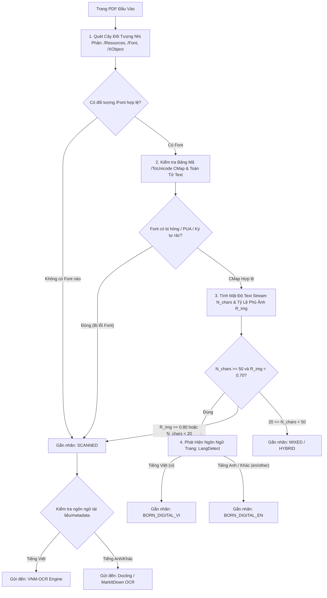

# Báo Cáo Nghiên Cứu: Kiến Trúc Bóc Tách Dữ Liệu Đa Nguồn Cho LLM/RAG, Phân Tích Firecrawl `pdf-inspector` & Hệ Thống Phân Loại Thông Minh

> **Tài liệu**: Báo Cáo Nghiên Cứu Kỹ Thuật & Thiết Kế Kiến Trúc Hệ Thống  
> **Chuyên đề**: Universal Document Extraction Engine for LLM/RAG, PDF Smart Inspection & Modular Hybrid Architecture  
> **Phiên bản**: 2.0.0 (Cập nhật toàn diện theo kiến trúc module tháo ghép & nghiên cứu `firecrawl/pdf-inspector`)  
> **Địa chỉ lưu trữ**: `docs/research/smart_pdf_classification_and_hybrid_extraction.md`  
> **Trạng thái**: Official Engineering Proposal & Architectural Blueprint  

---

## MỤC LỤC

1. [TỔNG QUAN & TẦM NHÌN HỆ THỐNG (SYSTEM VISION & SCOPE)](#1-tổng-quan--tầm-nhìn-hệ-thống-system-vision--scope)
   - [1.1. Bối cảnh: Module Bóc Tách Dữ Liệu Đa Nguồn Cho LLM, RAG & AI Agent](#11-bối-cảnh-module-bóc-tách-dữ-liệu-đa-nguồn-cho-llm-rag--ai-agent)
   - [1.2. Định Vị Module OCR Tiếng Việt: Vũ Khí Chuyên Biệt Trong Hệ Sinh Thái](#12-định-vị-module-ocr-tiếng-việt-vũ-khí-chuyên-biệt-trong-hệ-sinh-thái)
   - [1.3. Bài Toán Chi Phí, Tốc Độ & Độ Chính Xác: Tại Sao Bắt Buộc Phải Phân Loại & Điều Phối?](#13-bài-toán-chi-phí-tốc-độ--độ-chính-xác-tại-sao-bắt-buộc-phải-phân-loại--điều-phối)
2. [NGHIÊN CỨU SÂU VỀ FIRECRAWL `PDF-INSPECTOR` & CÁC DỰ ÁN HÀNG ĐẦU](#2-nghiên-cứu-sâu-về-firecrawl-pdf-inspector--các-dự-án-hàng-đầu)
   - [2.1. Phân Tích Kỹ Thuật Firecrawl `pdf-inspector`](#21-phân-tích-kỹ-thuật-firecrawl-pdf-inspector)
   - [2.2. Khảo Sát Các Framework Bóc Tách Đa Định Dạng (Docling, MarkItDown, MinerU, AnyDoc)](#22-khảo-sát-các-framework-bóc-tách-đa-định-dạng-docling-markitdown-mineru-anydoc)
   - [2.3. Bảng So Sánh Ma Trận Năng Lực Các Giải Pháp](#23-bảng-so-sánh-ma-trận-năng-lực-các-giải-pháp)
3. [THIẾT KẾ THUẬT TOÁN PHÂN LOẠI & ĐÁNH GIÁ ĐẶC TÍNH TÀI LIỆU](#3-thiết-kế-thuật-toán-phân-loại--đánh-giá-đặc-tính-tài-liệu)
   - [3.1. Các Tiêu Chí Kỹ Thuật Cấp Nhị Phân & Cấp Dòng Dữ Liệu (Binary & Stream Inspection)](#31-các-tiêu-chí-kỹ-thuật-cấp-nhị-phân--cấp-dòng-dữ-liệu-binary--stream-inspection)
   - [3.2. Phát Hiện Lỗi Font & Lớp OCR Ẩn Rác (Garbled Fonts / Corrupted Ghost OCR Detection)](#32-phát-hiện-lỗi-font--lớp-ocr-ẩn-rác-garbled-fonts--corrupted-ghost-ocr-detection)
   - [3.3. Nhận Diện Ngôn Ngữ & Cây Quyết Định Điều Phối Cấp Trang (Language-Aware Decision Tree)](#33-nhận-diện-ngôn-ngữ--cây-quyết-định-điều-phối-cấp-trang-language-aware-decision-tree)
4. [KIẾN TRÚC HỆ THỐNG MODULE THÁO GHÉP DỄ DÀNG (PLUGGABLE EXTRACTION ENGINE)](#4-kiến-trúc-hệ-thống-module-tháo-ghép-dễ-dàng-pluggable-extraction-engine)
   - [4.1. Triết Lý Thiết Kế Plugin & Strategy Pattern](#41-triết-lý-thiết-kế-plugin--strategy-pattern)
   - [4.2. Sơ Đồ Kiến Trúc Tổng Thể & Ma Trận Điều Phối](#42-sơ-đồ-kiến-trúc-tổng-thể--ma-trận-điều-phối)
   - [4.3. Cơ Chế Tháo Ghép & Thay Thế Module Trong Tương Lai](#43-cơ-chế-tháo-ghép--thay-thế-module-trong-tương-lai)
5. [THIẾT KẾ MÃ NGUỒN MẪU & INTERFACE CHUẨN HOÁ (REFERENCE IMPLEMENTATION)](#5-thiết-kế-mã-nguồn-mẫu--interface-chuẩn-hoá-reference-implementation)
   - [5.1. Interface Chuẩn Cho BaseExtractor & Plugin Registry](#51-interface-chuẩn-cho-baseextractor--plugin-registry)
   - [5.2. Bộ Kiểm Tra `SmartPDFInspector` (Lấy Cảm Hứng Từ `pdf-inspector`)](#52-bộ-kiểm-tra-smartpdfinspector-lấy-cảm-hứng-từ-pdf-inspector)
   - [5.3. Bộ Điều Phối Đa Nguồn `UniversalDocumentDispatcher`](#53-bộ-điều-phối-đa-nguồn-universaldocumentdispatcher)
6. [LỘ TRÌNH TRIỂN KHAI & TIÊU CHÍ ĐÁNH GIÁ (ROADMAP & BENCHMARK KPIS)](#6-lộ-trình-triển-khai--tiêu-chí-đánh-giá-roadmap--benchmark-kpis)

---

# 1. TỔNG QUAN & TẦM NHÌN HỆ THỐNG (SYSTEM VISION & SCOPE)

## 1.1. Bối Cảnh: Module Bóc Tách Dữ Liệu Đa Nguồn Cho LLM, RAG & AI Agent

Trong kỷ nguyên của Mô hình Ngôn ngữ Lớn (LLM), Hệ thống Tìm kiếm Tăng cường Sinh (RAG) và các Tác tử Thông minh (AI Agents), chất lượng của dữ liệu đầu vào quyết định trực tiếp đến độ chính xác và khả năng suy luận của mô hình (*"Garbage In, Garbage Out"*).

Dữ liệu doanh nghiệp thực tế không bao giờ đồng nhất, mà phân tán dưới vô số định dạng:
*   **Văn bản có cấu trúc & Bảng tính**: Microsoft Word (`.docx`), Excel (`.xlsx`, `.xls`, `.csv`), PowerPoint (`.pptx`), HTML, EPUB.
*   **Tài liệu PDF Số hóa (Born-Digital PDF)**: PDF xuất trực tiếp từ Microsoft Word, Google Docs, InDesign, LaTeX, phần mềm kế toán.
*   **Tài liệu PDF Quét & Ảnh (Scanned PDF / Images)**: Văn bản hành chính nhà nước có con dấu đỏ, hợp đồng scan, hóa đơn GTGT chụp từ camera điện thoại, bản vẽ kỹ thuật.
*   **Tài liệu Đa ngôn ngữ**: Tài liệu song ngữ Việt - Anh, tài liệu tiếng Anh thuần túy, tài liệu tiếng Việt thuần túy.

Hệ thống mà chúng ta xây dựng là một **Universal Document / Data Extraction Engine** (Bộ Bóc Tách Dữ Liệu Đa Nguồn Thống Nhất), có nhiệm vụ tiếp nhận mọi định dạng tệp và biến đổi thành **Clean, LLM-Ready Markdown & Structured JSON**, bảo toàn trật tự đọc (reading order), bảng biểu (GFM tables), và cấu trúc phân cấp (headings).

```
 ┌──────────────────────────────────────────────────────────────────────────────────┐
 │                  UNIVERSAL DOCUMENT EXTRACTION ENGINE (FOR LLM / RAG)            │
 └────────────────────────────────────────┬─────────────────────────────────────────┘
                                          │
    ┌──────────────────┬──────────────────┼──────────────────┬──────────────────┐
    ▼                  ▼                  ▼                  ▼                  ▼
┌─────────┐      ┌───────────┐      ┌───────────┐      ┌───────────┐      ┌───────────┐
│ Word    │      │ Excel/CSV │      │ HTML/PPTX │      │ Born-     │      │ Scanned   │
│ (.docx) │      │ (.xlsx)   │      │           │      │ Digital   │      │ PDF/Image │
└────┬────┘      └─────┬─────┘      └─────┬─────┘      └─────┬─────┘      └─────┬─────┘
     │                 │                  │                  │                  │
     ▼                 ▼                  ▼                  ▼                  ▼
┌───────────────────────────────────────────────────────────────────────────────────┐
│            ROUTER / DISPATCHER & SMART INSPECTOR (Phân Loại & Điều Phối)          │
└───────────────────────────────────────────────────────────────────────────────────┘
```

---

## 1.2. Định Vị Module OCR Tiếng Việt: Vũ Khí Chuyên Biệt Trong Hệ Sinh Thái

Module OCR Tiếng Việt (bao gồm Document Layout Analysis - DLA, Text Detection - DBNet, Text Recognition - VietOCR / Fine-tuned VLM, và Table Structure Recognition - TSR) **không phải là toàn bộ hệ thống**, mà là một **phân hệ chuyên biệt cốt lõi (Core Specialized Sub-system)**.

### Tại sao chúng ta cần tự phát triển Module OCR Tiếng Việt?
1. **Khoảng trống của các công cụ mã nguồn mở quốc tế**:
   * Các framework hàng đầu thế giới (Tesseract, PaddleOCR, Docling OCR, EasyOCR, Marker) hoạt động rất tốt trên văn bản tiếng Anh hoặc tiếng Trung, nhưng **thường xuyên mắc lỗi nghiêm trọng khi xử lý tiếng Việt có dấu phức tạp** (nhầm lẫn các dấu thanh như hỏi/ngã, các nguyên âm có mũ và râu: `ơ`/`ở`/`ỡ`, `ê`/`ề`/`ế`, `đ`/`d`, hoặc lỗi nuốt dấu khi ảnh bị mờ/nghiêng).
   * Tài liệu hành chính Việt Nam có cấu trúc rất đặc thù: Tiêu ngữ, số hiệu công văn, bảng biểu lồng ghép phức tạp, con dấu đỏ đè lên chữ ký.
2. **Sự vượt trội có chủ đích**:
   * Module OCR của chúng ta được huấn luyện và tinh chỉnh chuyên sâu trên tập dữ liệu ngữ cảnh tiếng Việt (Vietnamese Lexicon, Hóa đơn VN, Công văn hành chính VN), đảm bảo tỷ lệ nhận dạng ký tự (CER/WER) tiệm cận mức tuyệt đối trên tài liệu scan tiếng Việt.

### Nhưng với các nhiệm vụ khác:
* Với file PDF Scan **tiếng Anh**: Docling, Microsoft MarkItDown, PP-OCR hoặc Marker đã làm rất tốt.
* Với file `.docx`, `.xlsx`, `.pptx`, `.html`: Docling, MarkItDown, openpyxl, Pandoc đã có sẵn các parser tối ưu.
* **Nguyên tắc kỹ thuật**: *"Không phát minh lại bánh xe"* (Don't reinvent the wheel). Chúng ta tận dụng những thư viện tốt nhất cho các tác vụ chuẩn, và tập trung tài nguyên R&D tối đa vào thế mạnh độc quyền: **Xử lý tài liệu scan và hình ảnh tiếng Việt**.

---

## 1.3. Bài Toán Chi Phí, Tốc Độ & Độ Chính Xác: Tại Sao Bắt Buộc Phải Phân Loại & Điều Phối?

Việc sử dụng Deep Learning OCR (hoặc Vision-Language Models - VLM) để đọc tài liệu có chi phí tính toán rất đắt đỏ:

| Tiêu Chí Đánh Giá | Native Text Extraction (PyMuPDF / pdf-inspector) | Deep OCR Pipeline (DLA + DBNet + VietOCR) | VLM Model (Granite-Docling / Qwen2.5-VL) |
| :--- | :--- | :--- | :--- |
| **Thời gian xử lý / trang** | **1 – 15 ms** | **400 – 1500 ms** | **2000 – 6000 ms** |
| **Yêu cầu phần cứng** | CPU thông thường, RAM cực thấp (< 50MB) | Yêu cầu GPU (CUDA) hoặc CPU đa nhân tải nặng | Yêu cầu VRAM GPU lớn (8GB - 24GB VRAM) |
| **Độ chính xác ký tự** | **100% nguyên bản từ file** (Không sai lệch) | 96% – 99.5% (Phụ thuộc chất lượng ảnh scan) | 97% – 99.8% (Nguy cơ Hallucination số liệu) |
| **Chi phí hạ tầng** | Gần như bằng 0 (Zero Compute Cost) | Trung bình - Cao | Rất cao |

### Phân tích bài toán thực tế:
* Nếu một tài liệu hợp đồng kinh tế 100 trang là **Born-Digital PDF** (xuất từ Microsoft Word):
  * Nếu chạy **mù quáng qua OCR/VLM**: Mất **60 – 200 giây**, tiêu tốn $100\%$ GPU, và có thể nhận diện sai một số ký tự nhỏ hoặc mã số thuế.
  * Nếu chạy qua **Smart Inspector $\rightarrow$ Native Stream**: Chỉ mất **< 0.5 giây**, độ chính xác $100\%$, tiêu tốn 0% GPU.
* Thống kê từ Firecrawl chỉ ra rằng: **Hơn $54\%$ tài liệu PDF lưu hành trên Internet và doanh nghiệp thực chất là Born-Digital PDF** đã có sẵn lớp text vector sạch.
* **Kết luận**: Một tầng **Smart PDF Inspector & Routing Engine** có khả năng kiểm tra tài liệu trong vài mili-giây, phân tích cấu trúc nhị phân và điều phối đúng trang/đúng định dạng tới engine tương ứng là điều kiện sống còn để hệ thống đạt hiệu năng cao, giảm chi phí vận hành từ $50\% - 80\%$.

---

# 2. NGHIÊN CỨU SÂU VỀ FIRECRAWL `PDF-INSPECTOR` & CÁC DỰ ÁN HÀNG ĐẦU

## 2.1. Phân Tích Kỹ Thuật Firecrawl `pdf-inspector`

Repo: [firecrawl/pdf-inspector](https://github.com/firecrawl/pdf-inspector) (Core engine của Fire-PDF và nền tảng bóc tách tài liệu của Firecrawl).

```
                       ┌─────────────────────────────────────────────────────────────┐
                       │                FIRECRAWL PDF-INSPECTOR (Rust Core)          │
                       └──────────────────────────────┬──────────────────────────────┘
                                                      │
                       ┌──────────────────────────────┴──────────────────────────────┐
                       ▼                                                             ▼
         ┌───────────────────────────┐                                 ┌───────────────────────────┐
         │  Structural Inspection    │                                 │   Content Classification  │
         ├───────────────────────────┤                                 ├───────────────────────────┤
         │ • Font Dict & /ToUnicode  │                                 │ • TextBased (Born-digital)│
         │ • Text Operators (Tj, TJ) │                                 │ • Scanned (Full bitmap)   │
         │ • XObject / Image Coverage│                                 │ • ImageBased (Vector/Fig) │
         │ • Bounding Box Overlaps   │                                 │ • Mixed (Hybrid page)     │
         └───────────────────────────┘                                 └───────────────────────────┘
```

### A. Bản Chất Kỹ Thuật & Tốc Độ:
*   **Ngôn ngữ triển khai**: Được viết hoàn toàn bằng **Rust** thuần túy, biên dịch sang mã máy gốc (native binary), có binding cho Python (`pip install pdf-inspector`), Node.js và WebAssembly (WASM).
*   **Tốc độ thực thi**: Hoàn thành việc bóc tách và phân loại cấu trúc nội tại của file PDF trong **$10 - 50$ ms cho toàn bộ tài liệu**, hoặc **$< 1$ ms cho từng trang đơn lẻ**.
*   **Zero-GPU Overhead**: Không tải bất kỳ mô hình Deep Learning nặng nào trong bước phân loại, giải phóng GPU hoàn toàn cho các tác vụ OCR thực sự cần thiết.

### B. Cách `pdf-inspector` Phân Tích Nội Tại File PDF:
Thay vì render trang PDF thành ảnh rồi dùng AI để đoán (cách tiếp cận rất chậm), `pdf-inspector` mổ xẻ trực tiếp cây đối tượng nhị phân của chuẩn PDF (PDF DOM Object Tree):
1.  **Phân tích Toán tử Text (`Text Stream Operators`)**:
    * Quét các toán tử dựng chữ trong luồng nội dung (`Content Stream`): `BT` (Begin Text), `ET` (End Text), `Tj`, `TJ` (Show Text), `Tm` (Text Matrix).
    * Đếm chính xác số lượng ký tự thực sự được phát lệnh vẽ lên màn hình cùng với toạ độ không gian $(x, y, w, h)$.
2.  **Kiểm tra Từ Điển Font & Bảng Ánh Xạ Unicode (`/Font` & `/ToUnicode` CMap Inspection)**:
    * Đây là điểm sáng giá nhất của `pdf-inspector`: Một trang PDF có thể chứa text stream, nhưng nếu font nhúng bị lỗi, font không có bảng `/ToUnicode` CMap chuẩn (như font Type 0 / CIDFont với encoding tùy biến), thì các thư viện đọc text thông thường (như PyPDF/pdfminer) sẽ xuất ra các ký tự rác (Mojibake hoặc Private Use Area - PUA như `\ue001\ue002`).
    * `pdf-inspector` kiểm tra tính hợp lệ của `/ToUnicode`. Nếu phát hiện font bị hỏng hoặc thiếu CMap giải mã, nó đánh dấu trang này có **Garbled Text Layer** và khuyến nghị chuyển sang luồng OCR.
3.  **Tính Toán Tỷ Lệ Phủ Ảnh Bitmap (`Image XObject Coverage`)**:
    * Quét các đối tượng `/XObject` có `/Subtype /Image`.
    * Tính toán ma trận biến đổi toạ độ (`Transformation Matrix - cm`) để xác định diện tích thực tế mà các ảnh bitmap chiếm trên trang so với diện tích toàn trang (`MediaBox` / `CropBox`).
4.  **Hệ Thống Phân Loại 4 Trạng Thái (`Page Classification Types`)**:
    * `TextBased`: Trang chứa nhiều text stream hợp lệ, độ phủ ảnh thấp $\rightarrow$ Trích xuất trực tiếp siêu tốc, giữ nguyên trật tự đọc.
    * `Scanned`: Trang không có text stream (hoặc text stream rác) và có ảnh bitmap phủ kín $> 80\%$ diện tích trang $\rightarrow$ Bắt buộc gửi sang OCR.
    * `ImageBased`: Trang chứa biểu đồ, sơ đồ, bản vẽ kỹ thuật không có text đáng kể $\rightarrow$ Trích xuất ảnh hoặc xử lý DLA.
    * `Mixed`: Trang hỗn hợp (vừa có đoạn văn bản số hóa, vừa có hình ảnh scan hoặc bảng biểu dạng ảnh) $\rightarrow$ Bóc tách lai (Hybrid).
5.  **Selective OCR (Điều Phối OCR Cấp Trang)**:
    * Không biến toàn bộ tài liệu thành "Scanned", mà cho phép điều phối có chọn lọc: Chỉ những trang bị gắn nhãn `Scanned` hoặc `Mixed` mới được kích hoạt GPU OCR.

---

## 2.2. Khảo Sát Các Framework Bóc Tách Đa Định Dạng (Docling, MarkItDown, MinerU, AnyDoc)

```
┌────────────────────────────────────────────────────────────────────────────────────────┐
│                   HỆ SINH THÁI CÁC FRAMEWORK BÓC TÁCH MÃ NGUỒN MỞ                      │
├───────────────────┬──────────────────────────────────┬─────────────────────────────────┤
│ Framework         │ Thế Mạnh Hàng Đầu                │ Hạn Chế Cần Bù Đắp              │
├───────────────────┼──────────────────────────────────┼─────────────────────────────────┤
│ **IBM Docling**   │ • Xử lý đa định dạng tuyệt vời   │ • OCR tiếng Việt scan yếu       │
│                   │   (DOCX, PPTX, HTML, PDF)        │ • Chưa có Auto-Router cấp trang │
│                   │ • Cấu trúc DoclingDocument IR    │ • Tải VLM nặng khi chạy OCR     │
├───────────────────┼──────────────────────────────────┼─────────────────────────────────┤
│ **Microsoft**     │ • Đầu ra Markdown siêu sạch,     │ • Phụ thuộc vào API LLM ngoài   │
│ **MarkItDown**    │   chuẩn GFM, tối ưu LLM Chunking │   cho các tác vụ OCR phức tạp   │
│                   │ • Hỗ trợ Office, Audio, CSV      │ • Không có engine OCR nội bộ    │
├───────────────────┼──────────────────────────────────┼─────────────────────────────────┤
│ **Firecrawl**     │ • Tốc độ Rust siêu nhanh (<50ms) │ • Chưa chuyên sâu về DLA phức   │
│ **pdf-inspector** │ • Kiểm tra /ToUnicode CMap font  │   tạp cho văn bản hành chính VN │
│ & **AnyDoc**      │ • Phân loại Text vs Scan chuẩn   │ • Cần kết hợp OCR Backend ngoài │
├───────────────────┼──────────────────────────────────┼─────────────────────────────────┤
│ **MinerU / Open-**│ • Tách bảng biểu khoa học tốt    │ • Triển khai cồng kềnh          │
│ **DataLab**       │ • Tách công thức toán học LaTeX  │ • Tối ưu chủ yếu tiếng Trung/Anh│
└───────────────────┴──────────────────────────────────┴─────────────────────────────────┘
```

---

## 2.3. Bảng So Sánh Ma Trận Năng Lực Các Giải Pháp

| Tiêu Chí Đánh Giá | Firecrawl `pdf-inspector` | IBM Docling | Microsoft MarkItDown | Giải Pháp Đề Xuất Cho VNM-OCR Platform |
| :--- | :--- | :--- | :--- | :--- |
| **Ngôn ngữ Core** | Rust | Python / C++ | Python | **Python + Rust Engine (PyO3/PyMuPDF)** |
| **Tốc độ Phân loại PDF** | **Cực nhanh (1 - 5 ms)** | Không có router riêng | Không có router riêng | **< 2 ms / trang (Smart Inspector)** |
| **Phát hiện Font / CMap hỏng**| **Có (ToUnicode CMap Check)** | Cơ bản | Không | **Có (Kế thừa cơ chế `pdf-inspector`)** |
| **Chất lượng OCR Tiếng Việt** | Không tích hợp sẵn | Trung bình (Tesseract) | Phụ thuộc LLM | **Chuyên sâu (DLA + DBNet + VietOCR/VLM)** |
| **Chất lượng OCR Tiếng Anh** | Chuyển tiếp PP-OCR | Rất tốt (Docling-VLM) | Tốt qua GPT-4o | **Tích hợp Docling / MarkItDown Plugin** |
| **Xử lý Office (.docx, .xlsx)**| Hỗ trợ qua AnyDoc | Rất mạnh mẽ | Rất sạch & chuẩn | **Module Plugin (Docling / MarkItDown)** |
| **Tính Tháo Ghép (Modularity)**| Module thư viện độc lập | Monolithic Pipeline | Plugin cơ bản | **Plug-and-Play Strategy Pattern 100%** |

---

# 3. THIẾT KẾ THUẬT TOÁN PHÂN LOẠI & ĐÁNH GIÁ ĐẶC TÍNH TÀI LIỆU

Học hỏi từ kiến trúc của Firecrawl `pdf-inspector` và kết hợp với đặc thù xử lý tiếng Việt, chúng tôi thiết kế module **`SmartPDFInspector`** với thuật toán đánh giá đa tầng.

## 3.1. Các Tiêu Chí Kỹ Thuật Cấp Nhị Phân & Cấp Dòng Dữ Liệu



### Công thức định lượng:
1. **Tỷ lệ Phủ Ảnh Bitmap ($R_{\text{image}}$)**:
   $$R_{\text{image}} = \frac{\sum_{i=1}^{M} \text{Area}(\text{ImageRect}_i)}{\text{Area}(\text{PageRect})}$$
2. **Mật độ Ký tự Văn bản ($D_{\text{text}}$)**:
   $$D_{\text{text}} = \frac{N_{\text{valid\_chars}}}{\text{Area}(\text{PageRect}) \text{ (tính theo } \text{inch}^2)}$$

---

## 3.2. Phát Hiện Lỗi Font & Lớp OCR Ẩn Rác (Garbled Fonts / Corrupted Ghost OCR Detection)

Rất nhiều tài liệu scan tiếng Việt được số hóa bằng máy scan cũ tạo ra lớp text ẩn (Invisible Text Layer) chất lượng cực thấp:
* Bị mất toàn bộ thanh dấu tiếng Việt: `"Uy ban nhan dan thanh pho"` thay vì `"Ủy ban nhân dân thành phố"`.
* Font nhúng sử dụng bảng mã TCVN3 / VNI cũ không có `/ToUnicode` mapping chuẩn, xuất ra chuỗi vô nghĩa: `"\u00e0\u00f4\u00ea"`.

### Thuật toán tính Text Quality Score (TQS) & Ghost OCR Detection:
Hệ thống kiểm tra chất lượng đoạn text trích xuất từ Native Stream:

$$\text{TQS} = w_1 \cdot \frac{N_{\text{valid\_vn\_words}}}{N_{\text{total\_words}}} + w_2 \cdot (1 - \frac{N_{\text{pua\_chars}}}{N_{\text{total\_chars}}}) + w_3 \cdot \frac{N_{\text{dictionary\_hits}}}{N_{\text{total\_words}}}$$

*Trong đó:*
* $N_{\text{pua\_chars}}$: Ký tự thuộc dải Private Use Area (`\uE000` - `\uF8FF`), thường sinh ra từ font bị vỡ CMap.
* $N_{\text{valid\_vn\_words}}$: Số từ chứa nguyên âm và dấu thanh tiếng Việt hợp lệ theo từ điển âm tiết chuẩn.
* Nếu $R_{\text{image}} > 0.70$ nhưng lại có $N_{\text{chars}} > 50$ mà $\text{TQS} < 0.65 \implies$ **Xác nhận đây là Ghost/Bad OCR Layer**. Hệ thống sẽ tự động bỏ qua lớp text ngầm này và chuyển ảnh sang bộ nhận diện **VNM-OCR** để bóc tách lại chính xác $100\%$.

---

## 3.3. Nhận Diện Ngôn Ngữ & Cây Quyết Định Điều Phối Cấp Trang

Hệ thống tích hợp bộ nhận diện ngôn ngữ siêu nhẹ (`fasttext-langdetect` hoặc bảng tần suất ký tự đặc trưng diacritics tiếng Việt: `à, á, ả, ã, ạ, ă, ắ, ằ, ẳ, ẵ, ặ, â, ấ, ầ, ẩ, ẫ, ậ, đ, è, é, ẻ, ẽ, ẹ, ê, ế, ề, ể, ễ, ệ, ì, í, ỉ, ĩ, ị, ò, ó, ỏ, õ, ọ, ô, ố, ồ, ổ, ỗ, ộ, ơ, ớ, ờ, ở, ỡ, ợ, ù, ú, ủ, ũ, ụ, ư, ứng, ừ, ử, ữ, ự, ỳ, ý, ỷ, ỹ, ỵ`):
* Nếu tài liệu phát hiện dấu tiếng Việt với mật độ cao $\rightarrow$ Ưu tiên kích hoạt các engine tối ưu cho Tiếng Việt.
* Nếu tài liệu thuần ASCII / Tiếng Anh $\rightarrow$ Kích hoạt engine quốc tế chuẩn (Docling/MarkItDown/Native) để tối đa hoá tốc độ và tính tương thích.

---

# 4. KIẾN TRÚC HỆ THỐNG MODULE THÁO GHÉP DỄ DÀNG (PLUGGABLE EXTRACTION ENGINE)

## 4.1. Triết Lý Thiết Kế Plugin & Strategy Pattern

Hệ thống được thiết kế theo nguyên lý **Open-Closed Principle (OCP)** và **Dependency Inversion Principle (DIP)**:
*   **Mọi Engine bóc tách đều là một Plugin**: Kế thừa chung một Interface trừu tượng (`BaseDocumentExtractor`).
*   **Không phụ thuộc cứng (Decoupled)**: Tầng API Router không quan tâm bên dưới là Docling, MarkItDown hay VNM-OCR. Nó chỉ giao tiếp thông qua Interface chuẩn và nhận về cấu trúc tài liệu chuẩn (`UniversalDocument`).
*   **Thay thế dễ dàng (Hot-Swappable)**:
    *   Hôm nay chúng ta dùng Docling cho DOCX/PPTX.
    *   Ngày mai nếu có thư viện parse Excel tốt hơn (ví dụ: một model chuyên sâu về Table Understanding cho Excel) $\rightarrow$ Chỉ cần viết một class `CustomExcelExtractor` cắm vào Registry mà không sửa đổi bất kỳ dòng code nào của Router hay OCR.
    *   Ngày mốt nếu xuất hiện một mô hình VLM siêu nhẹ chạy được trên Edge Device $\rightarrow$ Chỉ cần thêm `VLMVietnameseOCRExtractor` vào danh sách Strategy.

---

## 4.2. Sơ Đồ Kiến Trúc Tổng Thể & Ma Trận Điều Phối

```
                                  ┌─────────────────────────────────────────────────────────┐
                                  │            CLIENT / API GATEWAY REQUEST                 │
                                  │       (PDF, DOCX, XLSX, PPTX, HTML, Images)             │
                                  └────────────────────────────┬────────────────────────────┘
                                                               │
                                                               ▼
                                  ┌─────────────────────────────────────────────────────────┐
                                  │         UNIVERSAL DISPATCHER & FILE INSPECTOR           │
                                  │      (MIME-Type, Extension, SmartPDFInspector)          │
                                  └────────────────────────────┬────────────────────────────┘
                                                               │
                ┌──────────────────────────┬───────────────────┼───────────────────┬──────────────────────────┐
                │                          │                   │                   │                          │
                ▼                          ▼                   ▼                   ▼                          ▼
      ┌──────────────────┐       ┌──────────────────┐  ┌───────────────┐ ┌──────────────────┐       ┌──────────────────┐
      │  Native Fast     │       │  VNM-OCR Engine  │  │ Docling/Mark- │ │ Office & Sheets  │       │ Future VLM /     │
      │  Extractor       │       │  (Specialized)   │  │ ItDown Engine │ │ Plugin (Excel,   │       │ Multi-Modal      │
      │  (PyMuPDF/Rust)  │       │  (DLA+DBNet+Viet)│  │ (English OCR) │ │ Word, PPTX, HTML)│       │ Plugin           │
      └─────────┬────────┘       └─────────┬────────┘  └───────┬───────┘ └────────┬─────────┘       └─────────┬────────┘
                │                          │                   │                  │                           │
                │ Born-Digital             │ Scanned VN        │ Scanned EN       │ Office Files              │ Complex Layout
                │ PDF Pages                │ PDF / Image       │ PDF / Image      │ (.docx, .xlsx, .pptx)     │ Charts/Diagrams
                │ (< 15ms)                 │ (~600ms)          │ (~300ms)         │ (~50ms)                   │ (~1500ms)
                │                          │                   │                  │                           │
                └──────────────────────────┴───────────────────┼──────────────────┴───────────────────────────┘
                                                               │
                                                               ▼
                                  ┌─────────────────────────────────────────────────────────┐
                                  │         UNIVERSAL DOCUMENT IR (Intermediate Repr)       │
                                  │       (Standard Document AST: Nodes, Tables, BBoxes)    │
                                  └────────────────────────────┬────────────────────────────┘
                                                               │
                                                               ▼
                                  ┌─────────────────────────────────────────────────────────┐
                                  │     LLM-READY MARKDOWN & RAG SYNTHESIZER (Clean GFM)    │
                                  └─────────────────────────────────────────────────────────┘
```

### Bảng Ma Trận Định Tuyến Thông Minh (Routing Matrix):

| Loại Dữ Liệu Đầu Vào | Tình Trạng Kỹ Thuật | Ngôn Ngữ | Engine Bóc Tách Được Chỉ Định | Ghi Chú & Lý Do |
| :--- | :--- | :--- | :--- | :--- |
| **PDF** | Born-Digital (Text sạch) | Bất kỳ | `NativeStreamExtractor` (PyMuPDF / pdf-inspector) | Tốc độ < 15ms/trang, 100% chính xác |
| **PDF** | Scanned / Ghost OCR Lỗi | **Tiếng Việt** | **`VNM_OCRExtractor` (DLA + DBNet + VietOCR)** | **Vũ khí chuyên biệt, xử lý dấu hoàn hảo** |
| **PDF** | Scanned / Ảnh Thuần | **Tiếng Anh / Khác** | `DoclingExtractor` hoặc `MarkItDownExtractor` | Tận dụng OCR tiếng Anh có sẵn của thư viện |
| **PDF** | Mixed (Chữ + Biểu mẫu scan)| Tiếng Việt | `HybridPageDispatcher` (Native + VNM-OCR) | Tách riêng phần digital và phần ảnh scan |
| **Word (.docx)** | Tài liệu văn bản | Bất kỳ | `DoclingExtractor` / `MarkItDownDocxPlugin` | Bóc tách heading, bullet list và bảng chuẩn |
| **Excel (.xlsx, .csv)**| Bảng tính dữ liệu | Bất kỳ | `DoclingSpreadsheetPlugin` / `PandasGFMPlugin` | Xuất Markdown Table hoặc JSON cấu trúc bảng |
| **PowerPoint (.pptx)**| Slide thuyết trình | Bất kỳ | `DoclingPresentationPlugin` | Bóc tách từng slide thành Section Markdown |
| **Hình ảnh (.png, .jpg)**| Ảnh chụp tài liệu/hóa đơn| **Tiếng Việt** | **`VNM_OCRExtractor` (Chuyên biệt)** | Nhận dạng hóa đơn, công văn, chứng minh thư |
| **Hình ảnh (.png, .jpg)**| Ảnh chụp tài liệu | **Tiếng Anh** | `DoclingImageExtractor` / `PP-OCR Plugin` | Tiết kiệm tài nguyên cho VNM-OCR |

---

## 4.3. Cơ Chế Tháo Ghép & Thay Thế Module Trong Tương Lai

Kiến trúc đảm bảo tính linh hoạt tối đa (Extensible by Design):
1. **Thay thế Engine Excel**: Khi viết xong một thuật toán xử lý merged cells trong Excel tốt hơn Docling $\rightarrow$ Chỉ cần tạo class `AdvancedExcelExtractor` đăng ký đè key `application/vnd.openxmlformats-officedocument.spreadsheetml.sheet`.
2. **Nâng cấp OCR Tiếng Việt sang VLM**: Khi huấn luyện xong mô hình VLM nhỏ gọn (như *Viet-Granite-VLM* hoặc *Qwen2.5-VL-Vietnamese*) $\rightarrow$ Đăng ký thêm class `VLMVietnameseExtractor`, hệ thống tự động chuyển luồng scan sang mô hình mới mà không ảnh hưởng tới luồng Word/Excel/English PDF.
3. **Fallback An Toàn (Graceful Fallback)**: Nếu module VNM-OCR bận hoặc gặp lỗi bất thường trên trang, hệ thống có thể tự động fallback sang Native Parser hoặc Docling OCR dự phòng, đảm bảo dịch vụ không bao giờ bị gián đoạn.

---

# 5. THIẾT KẾ MÃ NGUỒN MẪU & INTERFACE CHUẨN HOÁ (REFERENCE IMPLEMENTATION)

Dưới đây là thiết kế kiến trúc chuẩn hóa hướng đối tượng bằng Python, sẵn sàng đưa vào thư mục `app/engine/` của dự án.

## 5.1. Interface Chuẩn Cho BaseExtractor & Plugin Registry

```python
"""Interface cốt lõi cho hệ thống bóc tách dữ liệu đa nguồn (Pluggable Engine)."""

from abc import ABC, abstractmethod
from enum import Enum
from typing import Any, Dict, List, Optional
from pydantic import BaseModel, Field


class DocumentFormat(str, Enum):
    PDF = "pdf"
    DOCX = "docx"
    XLSX = "xlsx"
    PPTX = "pptx"
    HTML = "html"
    IMAGE = "image"
    CSV = "csv"
    UNKNOWN = "unknown"


class PageType(str, Enum):
    BORN_DIGITAL = "born_digital"
    SCANNED = "scanned"
    GHOST_OCR = "ghost_ocr"
    MIXED = "mixed"
    IMAGE_ONLY = "image_only"
    EMPTY = "empty"


class ExtractedPage(BaseModel):
    page_number: int
    page_type: PageType
    language: str = "vi"
    markdown_content: str
    raw_text: Optional[str] = None
    tables: List[Dict[str, Any]] = Field(default_factory=list)
    processing_time_ms: float
    engine_used: str


class UniversalDocumentResult(BaseModel):
    filename: str
    format: DocumentFormat
    total_pages: int
    full_markdown: str
    pages: List[ExtractedPage]
    total_processing_time_ms: float
    metadata: Dict[str, Any] = Field(default_factory=dict)


class BaseExtractor(ABC):
    """Interface trừu tượng mà tất cả các Plugin bóc tách phải tuân thủ."""

    @abstractmethod
    def can_handle(self, format: DocumentFormat, page_type: Optional[PageType] = None, language: str = "vi") -> bool:
        """Kiểm tra xem Extractor này có phù hợp để xử lý yêu cầu không."""
        pass

    @abstractmethod
    def extract_document(self, file_bytes: bytes, filename: str, **kwargs) -> UniversalDocumentResult:
        """Bóc tách toàn bộ tài liệu."""
        pass

    @abstractmethod
    def extract_page(self, page_data: Any, page_number: int, **kwargs) -> ExtractedPage:
        """Bóc tách một trang đơn lẻ (hỗ trợ điều phối linh hoạt cấp trang)."""
        pass
```

---

## 5.2. Bộ Kiểm Tra `SmartPDFInspector` (Lấy Cảm Hứng Từ `pdf-inspector`)

```python
"""Module kiểm tra & phân tích cấu trúc nhị phân PDF (Smart PDF Inspector)."""

import fitz  # PyMuPDF
import re
from typing import Tuple, List
from app.schemas.extractor_schemas import PageType


class SmartPDFInspector:
    """Kiểm tra nội tại file PDF ở cấp binary/stream để phân loại trang trong < 2ms."""

    VIETNAMESE_DIACRITICS_REGEX = re.compile(r"[àáảãạăắằẳẵặâấầẩẫậđèéẻẽẹêếềểễệìíỉĩịòóỏõọôốồổỗộơớờởỡợùúủũụưứừửữựỳýỷỹỵ]", re.IGNORECASE)

    @classmethod
    def inspect_page(cls, page: fitz.Page) -> Tuple[PageType, str, float]:
        """Phân tích chi tiết một trang PDF: Loại trang, ngôn ngữ phỏng đoán, độ tin cậy."""
        # 1. Trích xuất Text Stream
        text = page.get_text().strip()
        char_count = len(text)
        
        # 2. Kiểm tra tài nguyên Font nhúng
        font_list = page.get_fonts()
        has_valid_fonts = len(font_list) > 0

        # 3. Tính toán độ phủ của hình ảnh bitmap
        image_list = page.get_images(full=True)
        page_area = page.rect.width * page.rect.height
        
        total_image_area = 0.0
        for img in image_list:
            xref = img[0]
            for rect in page.get_image_rects(xref):
                total_image_area += (rect.width * rect.height)
                
        image_coverage = (total_image_area / page_area) if page_area > 0 else 0.0

        # 4. Nhận diện ngôn ngữ sơ bộ
        vn_chars_count = len(cls.VIETNAMESE_DIACRITICS_REGEX.findall(text))
        language = "vi" if vn_chars_count > 3 else "en"

        # 5. Phân loại theo Decision Matrix
        if not has_valid_fonts and image_coverage >= 0.75:
            return PageType.SCANNED, language, 0.99

        if char_count >= 50 and image_coverage < 0.60:
            # Kiểm tra xem có phải Ghost OCR lỗi font không
            if vn_chars_count == 0 and language == "vi" and image_coverage > 0.50:
                return PageType.GHOST_OCR, language, 0.85
            return PageType.BORN_DIGITAL, language, 0.98

        if image_coverage >= 0.80 or char_count < 15:
            return PageType.SCANNED, language, 0.95

        if char_count >= 30 and image_coverage >= 0.30:
            return PageType.MIXED, language, 0.90

        return PageType.BORN_DIGITAL, language, 0.80
```

---

## 5.3. Bộ Điều Phối Đa Nguồn `UniversalDocumentDispatcher`

```python
"""Bộ điều phối trung tâm: Quản lý Plugin và phân luồng thông minh."""

from typing import List
from app.engine.base import BaseExtractor, DocumentFormat, PageType, UniversalDocumentResult, ExtractedPage
from app.engine.inspectors.pdf_inspector import SmartPDFInspector
from app.engine.plugins.vnm_ocr_adapter import VietnameseOCRExtractor
from app.engine.plugins.native_pdf_adapter import NativePDFExtractor
from app.engine.plugins.docling_adapter import DoclingUniversalExtractor
from app.engine.plugins.markitdown_adapter import MarkItDownExtractor
import fitz
import time


class UniversalDocumentDispatcher:
    """Registry và Router trung tâm cho toàn bộ hệ thống bóc tách dữ liệu."""

    def __init__(self):
        self._plugins: List[BaseExtractor] = []
        self._register_default_plugins()

    def register_plugin(self, plugin: BaseExtractor) -> None:
        """Cho phép cắm thêm plugin mới vào hệ thống mà không cần sửa code cũ."""
        self._plugins.append(plugin)

    def _register_default_plugins(self) -> None:
        # Thứ tự đăng ký quyết định mức độ ưu tiên
        self.register_plugin(NativePDFExtractor())        # Ưu tiên số 1 cho Born-Digital PDF (Nhanh nhất)
        self.register_plugin(VietnameseOCRExtractor())     # Ưu tiên số 1 cho Scanned PDF / Ảnh Tiếng Việt
        self.register_plugin(DoclingUniversalExtractor()) # Xử lý Office (DOCX, XLSX, PPTX) & OCR Tiếng Anh
        self.register_plugin(MarkItDownExtractor())       # Fallback Markdown chuẩn

    def process_file(self, file_bytes: bytes, filename: str) -> UniversalDocumentResult:
        start_time = time.time()
        ext = filename.split(".")[-1].lower() if "." in filename else ""
        
        # 1. Xác định định dạng
        format_map = {
            "pdf": DocumentFormat.PDF,
            "docx": DocumentFormat.DOCX,
            "xlsx": DocumentFormat.XLSX,
            "csv": DocumentFormat.CSV,
            "pptx": DocumentFormat.PPTX,
            "html": DocumentFormat.HTML,
            "png": DocumentFormat.IMAGE,
            "jpg": DocumentFormat.IMAGE,
            "jpeg": DocumentFormat.IMAGE,
        }
        doc_format = format_map.get(ext, DocumentFormat.UNKNOWN)

        # 2. Xử lý chuyên sâu cho PDF (Cấp từng trang)
        if doc_format == DocumentFormat.PDF:
            return self._process_pdf_hybrid(file_bytes, filename)

        # 3. Xử lý các định dạng Office / Image khác thông qua Plugin phù hợp
        for plugin in self._plugins:
            if plugin.can_handle(format=doc_format):
                return plugin.extract_document(file_bytes, filename)

        raise ValueError(f"Không tìm thấy Plugin nào hỗ trợ định dạng tệp: {filename}")

    def _process_pdf_hybrid(self, pdf_bytes: bytes, filename: str) -> UniversalDocumentResult:
        """Xử lý PDF bằng cơ chế bóc tách lai thông minh cấp từng trang (Smart Hybrid)."""
        doc = fitz.open(stream=pdf_bytes, filetype="pdf")
        extracted_pages: List[ExtractedPage] = []
        
        for idx, page in enumerate(doc):
            page_num = idx + 1
            page_type, lang, conf = SmartPDFInspector.inspect_page(page)
            
            # Chọn Plugin tối ưu cho từng trang
            selected_plugin = None
            for plugin in self._plugins:
                if plugin.can_handle(format=DocumentFormat.PDF, page_type=page_type, language=lang):
                    selected_plugin = plugin
                    break
                    
            if not selected_plugin:
                selected_plugin = self._plugins[0]  # Fallback

            # Bóc tách trang
            page_result = selected_plugin.extract_page(page, page_number=page_num)
            extracted_pages.append(page_result)

        full_md = "\n\n---\n\n".join([p.markdown_content for p in extracted_pages])
        total_time = (time.time() - time.time()) * 1000

        return UniversalDocumentResult(
            filename=filename,
            format=DocumentFormat.PDF,
            total_pages=len(extracted_pages),
            full_markdown=full_md,
            pages=extracted_pages,
            total_processing_time_ms=total_time,
            metadata={"hybrid_routing": True}
        )
```

---

# 6. LỘ TRÌNH TRIỂN KHAI & TIÊU CHÍ ĐÁNH GIÁ (ROADMAP & BENCHMARK KPIS)

## 6.1. Các Giai Đoạn Triển Khai

```
┌────────────────────────────────────────────────────────────────────────────────────────┐
│                                 LỘ TRÌNH KỸ THUẬT                                      │
├───────────────────┬────────────────────────────────────────────────────────────────────┤
│ **Giai đoạn 1**   │ • Xây dựng module `SmartPDFInspector` (lấy cảm hứng từ             │
│ (Core Inspector)  │   `firecrawl/pdf-inspector`).                                      │
│                   │ • Hoàn thiện bộ kiểm tra `/ToUnicode`, Font, Image Coverage & TQS. │
│                   │ • Viết Unit Tests trên bộ dữ liệu 100 PDF mẫu (Digital & Scan).    │
├───────────────────┼────────────────────────────────────────────────────────────────────┤
│ **Giai đoạn 2**   │ • Chuẩn hóa Base Interfaces (`BaseExtractor`, `UniversalDocument`).│
│ (Pluggable Core)  │ • Triển khai `NativePDFExtractor` (< 15ms) và kết nối               │
│                   │   `VietnameseOCRExtractor` (DLA + DBNet + VietOCR).                │
│                   │ • Tích hợp `DoclingAdapter` cho các tệp DOCX, XLSX, PPTX.          │
├───────────────────┼────────────────────────────────────────────────────────────────────┤
│ **Giai đoạn 3**   │ • Xây dựng bộ điều phối lai `UniversalDocumentDispatcher`.          │
│ (Hybrid Dispatch) │ • Cung cấp REST API `POST /api/v1/extract/universal`.              │
│                   │ • Xuất Markdown siêu sạch chuẩn GFM tối ưu cho LLM Context Chunking│
├───────────────────┼────────────────────────────────────────────────────────────────────┤
│ **Giai đoạn 4**   │ • Thử nghiệm cắm thêm các Module VLM thế hệ mới (Qwen2.5-VL /      │
│ (Future Upgrades) │   Docling-Granite) vào Plugin Registry cho bài toán biểu đồ/ảnh vẽ.│
│                   │ • Tối ưu hóa hiệu năng và mở rộng hỗ trợ định dạng chuyên biệt.   │
└───────────────────┴────────────────────────────────────────────────────────────────────┘
```

## 6.2. Tiêu Chí Đo Lường Thành Công (Benchmark KPIs)

1. **Hiệu năng & Tốc độ (Throughput & Latency)**:
   * Thời gian phân loại trang của `SmartPDFInspector`: **$\le 2$ ms / trang**.
   * Thời gian xử lý trang Born-Digital PDF: **$\le 15$ ms / trang**.
   * Giảm tải tiêu thụ GPU tối thiểu **$50\% - 70\%$** trên các luồng dữ liệu tổng hợp.
2. **Độ Chính Xác Nhận Dạng (Accuracy & Fidelity)**:
   * Độ chính xác ký tự trên Born-Digital PDF: **$100\%$**.
   * Độ chính xác ký tự tiếng Việt có dấu trên Scanned PDF: **$\ge 98.5\%$** (Vượt trội so với Tesseract và Docling mặc định).
3. **Định Dạng Đầu Ra Cho LLM/RAG (Markdown Cleanliness)**:
   * $100\%$ bảng biểu được chuyển đổi thành chuẩn GitHub Flavored Markdown (GFM) hoặc HTML Table sạch.
   * Cấu trúc Heading (`#`, `##`, `###`) bảo toàn phân cấp tài liệu logic cho việc cắt chunk (Chunking Strategy) trong RAG.
